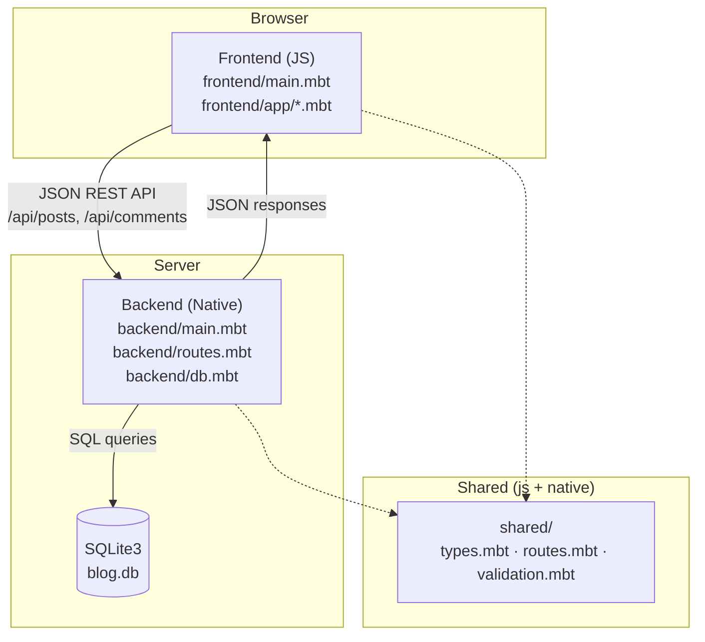
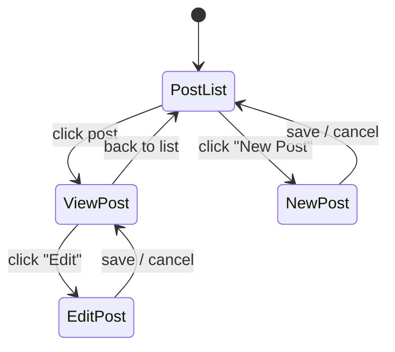
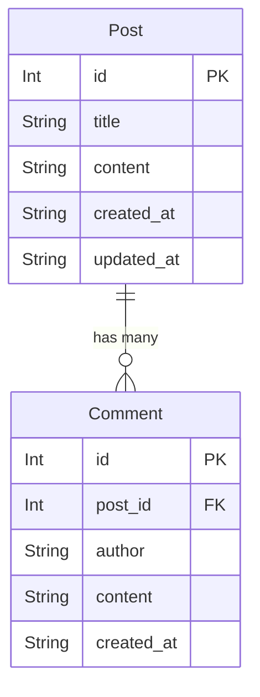
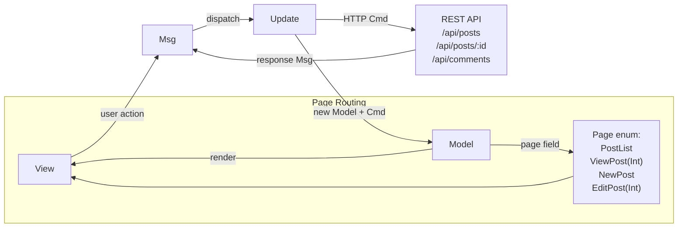

# Blog

A full-stack blog application written entirely in [MoonBit](https://www.moonbitlang.com/), with isomorphic code shared between frontend and backend.

- **Frontend**: [Rabbita](https://github.com/moonbit-community/rabbita) (Elm-architecture UI framework, compiles to JS)
- **Backend**: [Mocket](https://github.com/oboard/mocket) (HTTP server, compiles to native) + [SQLite3](https://github.com/myfreess/sqlite3) (persistence)
- **Shared**: Common types, routes, and validation compiled for both targets

## Quick Start

```bash
moon update
make serve
```

Open http://localhost:4001.

## Features

- Create, edit, and delete blog posts
- Comment on posts with optional author name (defaults to "Anonymous")
- Post list with content preview (unicode-safe truncation for emoji/CJK)
- Multi-page SPA navigation (list, detail, create, edit views)
- Data persists in SQLite (`blog.db`)
- Single codebase, two compilation targets (`js` for frontend, `native` for backend)
- REST API with JSON communication between frontend and backend

## Isomorphic Design

MoonBit compiles to multiple targets from the same source. This project uses three packages: `frontend/` targets JS, `backend/` targets native, and `shared/` has no target restriction so it compiles for both.

### What is shared

The `shared/` package contains code that both frontend and backend import:

- **`Post` and `Comment` types** (`types.mbt`) — structs with `derive(ToJson, FromJson, Show)`. The backend constructs values from SQLite rows and serializes them to JSON. The frontend deserializes the same JSON into the same types. The JSON contract is enforced by the compiler, not by convention.

- **Route paths** (`routes.mbt`) — API paths defined once. The frontend calls `@shared.api_post(id)` to build request URLs. The backend uses `@shared.api_posts` for route registration. Renaming an endpoint only requires changing one file.

- **Validation and utilities** (`validation.mbt`) — `validate_title()` checks that a post title is non-empty. `normalize_author()` defaults empty author names to "Anonymous". `truncate()` safely truncates unicode strings by character count. Same rules, one definition, enforced on both sides.

### Why it matters

In a typical web stack, frontend and backend define their data types independently. The only thing keeping them in sync is discipline or code generation. When they drift apart, you get runtime errors: a renamed field, a type mismatch, a mistyped route.

With isomorphic MoonBit, the `Post` type exists once. Add a field and both sides see it immediately — the frontend won't compile until its view handles the new field, and the backend won't compile until its database layer provides it. The compiler does what tests and API specs try to do, but statically.

## API

| Method | Path | Description |
|--------|------|-------------|
| `GET` | `/api/posts` | List all posts |
| `GET` | `/api/posts/:id` | Get a single post |
| `POST` | `/api/posts` | Create a post (`{"title": "...", "content": "..."}`) |
| `POST` | `/api/posts/:id` | Update a post (`{"title": "...", "content": "..."}`) |
| `DELETE` | `/api/posts/:id` | Delete a post |
| `GET` | `/api/posts/:id/comments` | List comments for a post |
| `POST` | `/api/posts/:id/comments` | Add a comment (`{"author": "...", "content": "..."}`) |
| `DELETE` | `/api/comments/:id` | Delete a comment |

## Project Structure

```
shared/              # Isomorphic code (both js and native)
  types.mbt          #   Post and Comment structs with ToJson/FromJson
  routes.mbt         #   API path constants and builders
  validation.mbt     #   Title validation, author normalization, unicode truncation
backend/
  main.mbt           # Mocket HTTP server entry point
  routes.mbt         # Route registration and handlers
  db.mbt             # SQLite3 CRUD operations
frontend/
  main.mbt           # Rabbita app entry point and wiring
  app/
    types.mbt         # Model, Msg, and Page definitions
    update.mbt        # Update logic and command dispatch
    view.mbt          # Top-level view routing
    view_post_list.mbt # Post list page
    view_post.mbt     # Single post detail page
    view_form.mbt     # Create/edit post form
    view_comments.mbt # Comment list and form
    update_test.mbt   # Update function tests
    view_test.mbt     # View rendering tests
public/              # Build output for frontend JS
moon.mod.json        # Module config and dependencies
Makefile             # Build and run commands
```

## Architecture

### System Architecture



### Page Navigation



### Data Model



### MVU Data Flow


