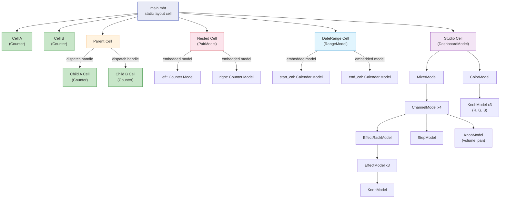
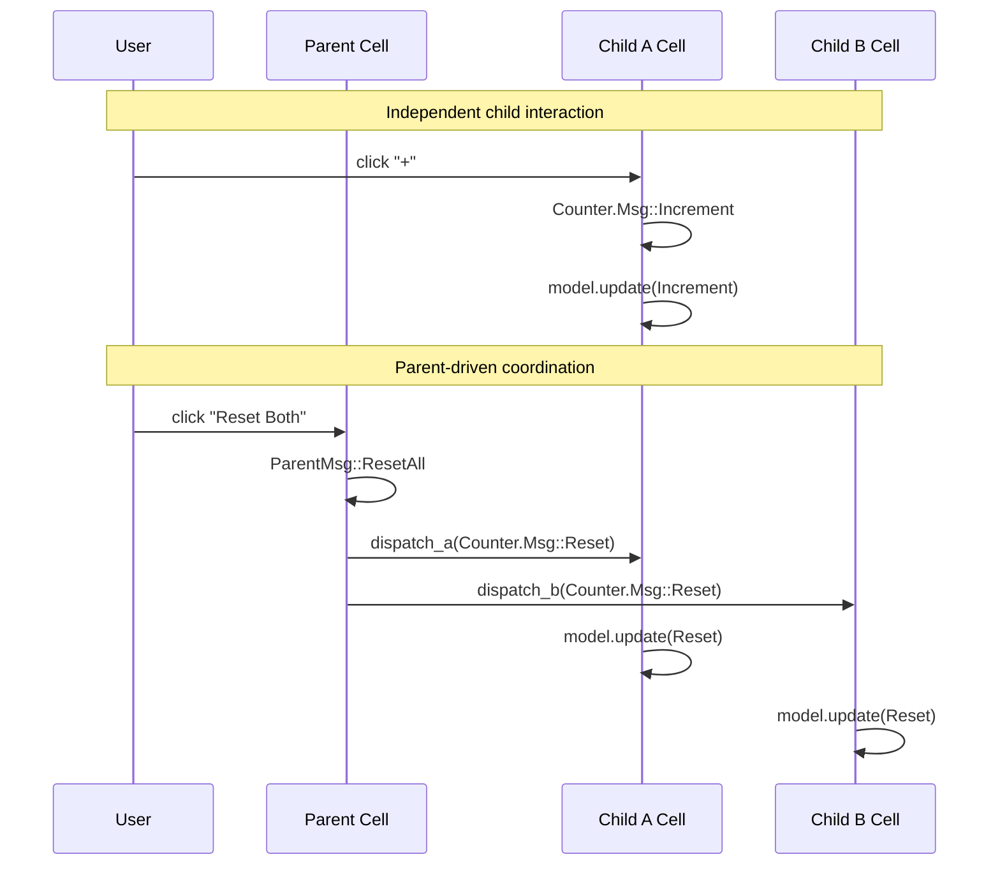
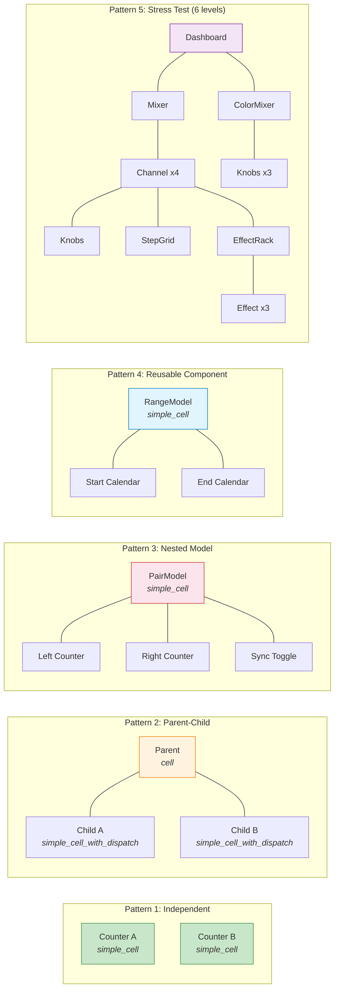

# TEA Composition Patterns

A catalog of [Rabbita](https://github.com/moonbit-community/rabbita) component composition patterns in [MoonBit](https://www.moonbitlang.com/). Five demos show how to nest, combine, and coordinate independent MVU (Model-Update-View) cells -- from the simplest side-by-side layout to a 6-level-deep music studio dashboard with ~78 state values.

- **Framework**: [Rabbita](https://github.com/moonbit-community/rabbita) (Elm-architecture UI, compiles to JS)
- **Frontend only** -- no backend, no server; open `index.html` directly or use `python3 -m http.server`

## Quick Start

```bash
moon update
make serve
```

Open http://localhost:4011.

Alternatively, open the file directly:

```bash
make open       # builds and opens public/index.html in the default browser
```

## Composition Patterns

### 1. Independent Cells

Two separate `Cell` instances, each with its own Model/Msg/update/view loop. They share no state -- clicking one never affects the other. This is the simplest form of composition: create multiple cells and render them side by side.

**When to use**: unrelated widgets on the same page that have no reason to communicate.

```
Cell A (Model, Msg, update, view)
Cell B (Model, Msg, update, view)
       |           |
[  A.view()  |  B.view()  ]   -- just HTML side by side
```

### 2. Parent-Child with Dispatch

The parent creates child cells using `simple_cell_with_dispatch`, which returns a `Dispatch` handle for each child. The parent can push messages into children through these handles. Clicking "Reset Both" sends `Reset` to both child cells from the parent.

**When to use**: a coordinator needs to send commands to children (e.g., "reset all", "select none"), but children do not need to talk to each other or back to the parent.

```
Parent Cell
  |-- dispatch_a : Dispatch[Counter.Msg]   -- handle to child A
  |-- dispatch_b : Dispatch[Counter.Msg]   -- handle to child B
  |
  |  on ResetAll:
  |    dispatch_a(Reset)   -- parent pushes msg into child A
  |    dispatch_b(Reset)   -- parent pushes msg into child B
```

### 3. Nested Model (Classic Elm)

A single `Cell` where the parent model embeds child models as fields, and the parent message type wraps child messages as variants. One update function pattern-matches and routes messages to the correct child. A "sync" toggle demonstrates cross-child coordination -- when enabled, every action applied to one counter is also applied to the other.

**When to use**: tightly coupled components where the parent needs to inspect or transform child state (e.g., syncing, validation across children).

```
PairModel
  |-- left  : Counter.Model
  |-- right : Counter.Model
  |-- sync  : Bool

PairMsg
  |-- Left(Counter.Msg)
  |-- Right(Counter.Msg)
  |-- ToggleSync
```

### 4. Reusable Complex Component

A full calendar/date-picker component with its own Model/Msg/update/view is instantiated twice to build a date-range picker. The parent routes messages to each instance via `Start(...)` / `End(...)` wrapper variants -- same component, two independent instances, composed through the nested model pattern.

**When to use**: you have a self-contained component (calendar, color picker, rich text editor) and need multiple instances in one view.

```
RangeModel
  |-- start_cal : Calendar.Model   -- first instance
  |-- end_cal   : Calendar.Model   -- second instance

RangeMsg
  |-- Start(Calendar.Msg)   -- route to start calendar
  |-- End(Calendar.Msg)     -- route to end calendar
```

### 5. Stress Test: Studio Control

A music studio dashboard that pushes nested model composition to its limit: 6 nesting levels, ~78 independent state values, and 7 message wrapping layers. The deepest user action (tweaking an effect knob) produces:

```
DashboardMsg::Mixer(MixerMsg::Ch1(ChannelMsg::Effects(
  EffectRackMsg::Fx1(EffectMsg::Intensity(KnobMsg::Increment)))))
```

Components include a 4-channel mixer with volume/pan knobs, mute/solo toggles, 8-step pattern sequencers, 3-effect racks per channel, an RGB color mixer, and a dark mode toggle.

**When to use**: validates that the composition pattern scales. If your architecture handles 6 levels cleanly, it handles 2-3 levels trivially.

## Project Structure

```
compose/
  moon.mod.json                # Module: bobzhang/compose-demo
  Makefile                     # build, serve (port 4011), open, clean
  public/
    index.html                 # Static shell with <div id="app">
    frontend.js                # Build output (generated)
  frontend/
    main.mbt                   # Entry point -- creates all demos, mounts layout
    counter/
      counter.mbt              # Reusable counter: Model, Msg, update, view
    independent/
      independent.mbt          # Pattern 1: two independent cells
    parent_child/
      parent_child.mbt         # Pattern 2: parent dispatches to children
    nested/
      nested.mbt               # Pattern 3: nested models with sync toggle
    calendar/
      calendar.mbt             # Reusable calendar/date-picker component
    date_range/
      date_range.mbt           # Pattern 4: two calendars as date-range picker
    stress_test/
      dashboard.mbt            # Level 1: Dashboard (top-level)
      mixer.mbt                # Level 2: Mixer (4 channels + master)
      color_mixer.mbt          # Level 2: RGB ColorMixer (3 knobs + swatch)
      channel.mbt              # Level 3: Channel (volume, pan, mute, solo, steps, FX)
      effects.mbt              # Levels 4-5: EffectRack (3 effects) + Effect (knob + toggle)
      widgets.mbt              # Level 6: Knob (bounded counter) + StepGrid (8-step pattern)
```

## Architecture Diagrams

### Component Hierarchy

How cells and nested models compose to form the full demo:



### Message Flow (Parent-Child Pattern)

How messages propagate in the parent-child dispatch pattern:



### Component Catalog

All demo components organized by composition pattern:


