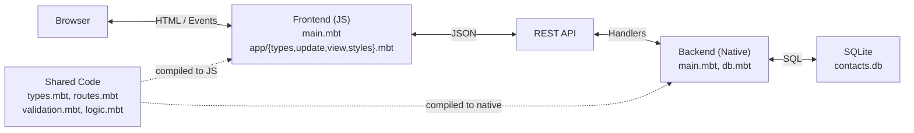
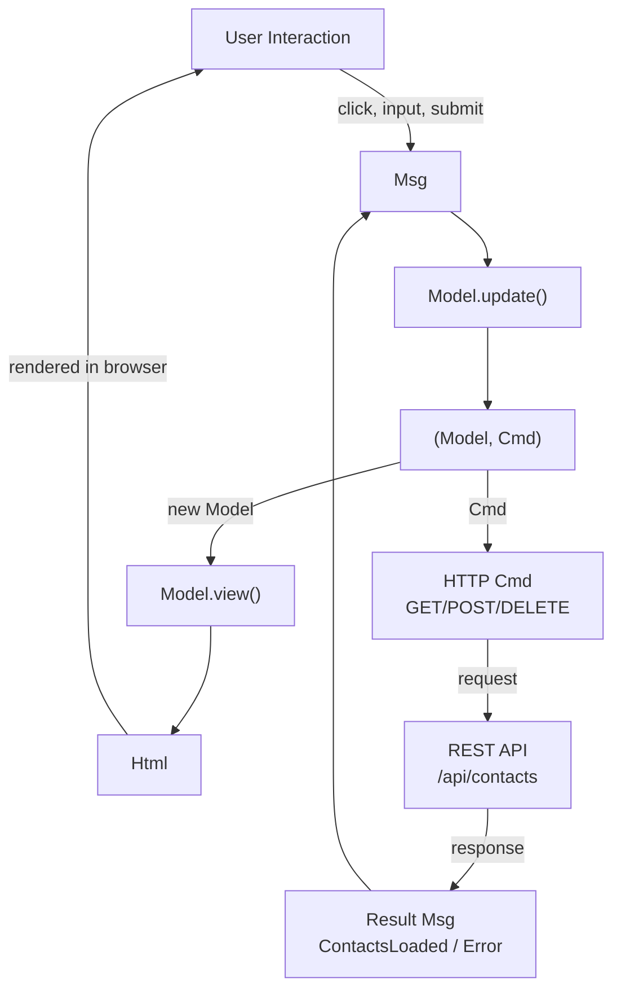
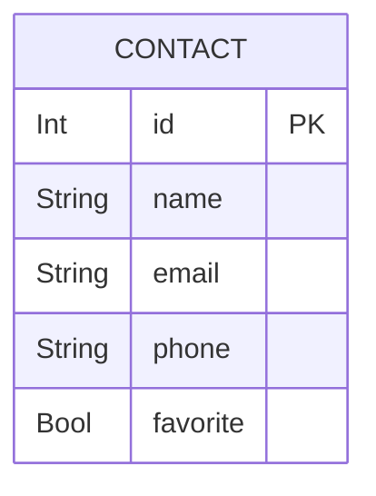

# Contacts

A full-stack address book application written entirely in [MoonBit](https://www.moonbitlang.com/), with isomorphic code shared between frontend and backend.

- **Frontend**: [Rabbita](https://github.com/moonbit-community/rabbita) (Elm-architecture UI framework, compiles to JS)
- **Backend**: [Mocket](https://github.com/oboard/mocket) (HTTP server, compiles to native) + [SQLite3](https://github.com/myfreess/sqlite3) (persistence)
- **Shared**: Common types, routes, validation, and business logic compiled for both targets

## Quick Start

```bash
moon update
make serve
```

Open http://localhost:4004.

## Features

- Add contacts with name, email, and phone number
- Mark contacts as favorites (displayed first)
- Real-time search across name, email, and phone fields
- Phone number formatting (10-digit numbers displayed as (XXX) XXX-XXXX)
- Contact avatars with initials and color-coded circles
- Alphabetical sorting with favorites pinned to top
- Input validation (email format, phone characters, field lengths)
- Data persists in SQLite (`contacts.db`)
- Single codebase, two compilation targets (`js` for frontend, `native` for backend)

## Isomorphic Design

MoonBit compiles to multiple targets from the same source. This project uses three packages: `frontend/` targets JS, `backend/` targets native, and `shared/` has no target restriction so it compiles for both.

### What is shared

The `shared/` package contains code that both frontend and backend import:

- **`Contact` type** (`types.mbt`) — one struct with `derive(ToJson, FromJson)`. The backend constructs `Contact` values from SQLite rows and serializes them. The frontend deserializes the same JSON into the same type. The JSON contract is enforced by the compiler.

- **Route paths** (`routes.mbt`) — API paths defined once. The frontend calls `@shared.api_contact_favorite(id)` to build request URLs. The backend uses `@shared.api_contacts` for route registration.

- **Validation** (`validation.mbt`) — `validate_name()`, `validate_email()`, and `validate_phone()` enforce input rules. The frontend calls them before submitting, the backend calls them before inserting. Same rules, one definition, enforced on both sides.

- **Business logic** (`logic.mbt`) — `match_search()` for case-insensitive search, `sort_contacts()` for favorites-first alphabetical ordering, `format_phone()` for display formatting, and `get_initials()` for avatar generation. The same logic runs on both targets.

## API

| Method | Path | Description |
|--------|------|-------------|
| `GET` | `/api/contacts` | List all contacts |
| `POST` | `/api/contacts` | Create a contact (`{"name": "...", "email": "...", "phone": "..."}`) |
| `POST` | `/api/contacts/:id/favorite` | Toggle favorite status |
| `DELETE` | `/api/contacts/:id` | Delete a contact |

## Project Structure

```
shared/              # Isomorphic code (both js and native)
  types.mbt          #   Contact struct with ToJson/FromJson
  routes.mbt         #   API path constants and builders
  validation.mbt     #   Name, email, phone validation rules
  logic.mbt          #   Search, sort, phone formatting, initials
backend/main.mbt     # Mocket HTTP server + SQLite3 CRUD
frontend/main.mbt    # Rabbita MVU app (model, update, view)
public/              # Build output for frontend JS
moon.mod.json        # Module config and dependencies
Makefile             # Build and run commands
```

## Architecture

### System Architecture



### Data Flow (MVU Cycle)



### Data Model


