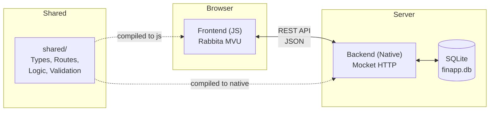
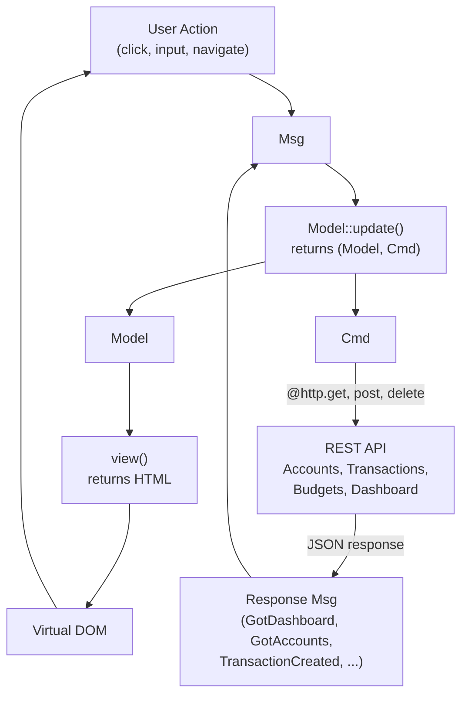
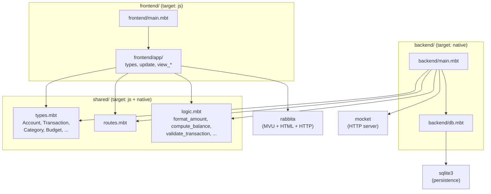
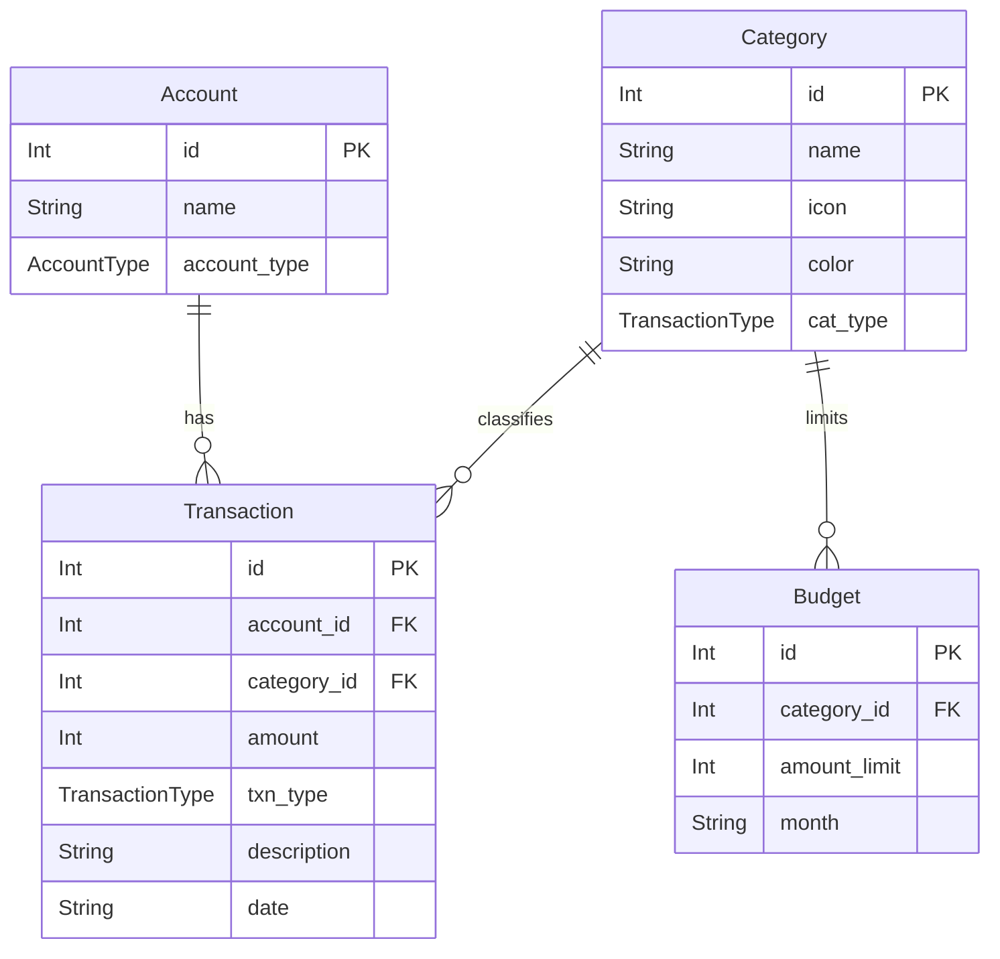

# Personal Finance Tracker

A full-stack personal finance application written entirely in [MoonBit](https://www.moonbitlang.com/), with isomorphic code shared between frontend and backend. Track accounts, transactions, budgets, and view a dashboard with monthly summaries and category breakdowns.

- **Frontend**: [Rabbita](https://github.com/moonbit-community/rabbita) (Elm-architecture UI framework, compiles to JS)
- **Backend**: [Mocket](https://github.com/oboard/mocket) (HTTP server, compiles to native) + [SQLite3](https://github.com/myfreess/sqlite3) (persistence)
- **Shared**: Common types, routes, validation, and financial logic compiled for both targets

## Quick Start

```bash
moon update
make serve
```

Open http://localhost:4007.

## Features

- **Accounts** — create and manage checking, savings, and credit card accounts
- **Transactions** — record income and expenses tied to accounts and categories
- **Budgets** — set monthly spending limits per category with progress tracking
- **Dashboard** — view account balances, monthly income/expense summary, budget statuses, and category spending breakdown
- **Validation** — shared input validation enforced on both client and server
- **Persistence** — all data stored in SQLite (`finapp.db`)
- **Single codebase** — two compilation targets (`js` for frontend, `native` for backend)

## Isomorphic Design

MoonBit compiles to multiple targets from the same source. This project uses three packages: `frontend/` targets JS, `backend/` targets native, and `shared/` has no target restriction so it compiles for both.

### What is shared

The `shared/` package contains code that both frontend and backend import:

- **Domain types** (`types.mbt`) — `Account`, `Transaction`, `Category`, `Budget`, `BudgetStatus`, `AccountBalance`, `MonthSummary`, and `DashboardData`, all with `derive(ToJson, FromJson)`. The backend constructs these from SQLite rows and serializes them to JSON. The frontend deserializes the same JSON into the same types. The JSON contract is enforced by the compiler, not by convention.

- **Route paths** (`routes.mbt`) — API paths defined once. The frontend calls `@shared.api_transaction(id)` to build request URLs. The backend uses `@shared.api_accounts` for route registration. Renaming an endpoint only requires changing one file.

- **Financial logic** (`logic.mbt`) — `format_amount`, `parse_amount`, `compute_balance`, `monthly_totals`, `category_spending`, `budget_progress`, and `spent_in_category`. The same dollar-formatting and balance-computation code runs on both sides. The backend uses it to build the dashboard; the frontend can use it for local calculations.

- **Validation** (`logic.mbt`) — `validate_transaction` and `validate_account_name` check inputs before submission on the frontend and before insertion on the backend. Same rules, one definition, enforced on both sides.

### Why it matters

In a typical web stack, frontend and backend define their data types independently. The only thing keeping them in sync is discipline or code generation. When they drift apart, you get runtime errors: a renamed field, a type mismatch, a mistyped route.

With isomorphic MoonBit, types like `Account` and `Transaction` exist once. Add a field and both sides see it immediately — the frontend won't compile until its view handles the new field, and the backend won't compile until its database layer provides it. The compiler does what tests and API specs try to do, but statically.

## API

| Method | Path | Description |
|--------|------|-------------|
| `GET` | `/api/accounts` | List all accounts |
| `POST` | `/api/accounts` | Create an account (`{"name": "...", "account_type": "..."}`) |
| `DELETE` | `/api/accounts/:id` | Delete an account |
| `GET` | `/api/categories` | List all categories |
| `GET` | `/api/transactions` | List all transactions |
| `POST` | `/api/transactions` | Create a transaction (`{"account_id", "category_id", "amount", "txn_type", "description", "date"}`) |
| `DELETE` | `/api/transactions/:id` | Delete a transaction |
| `GET` | `/api/budgets/:month` | List budgets for a month (e.g. `2026-03`) |
| `POST` | `/api/budgets` | Create or update a budget (`{"category_id", "amount_limit", "month"}`) |
| `DELETE` | `/api/budgets/:id` | Delete a budget |
| `GET` | `/api/dashboard/:month` | Get aggregated dashboard data for a month |

## Project Structure

```
shared/                  # Isomorphic code (both js and native)
  types.mbt              #   Account, Transaction, Category, Budget, DashboardData
  routes.mbt             #   API path constants and builders
  logic.mbt              #   Financial formatting, computation, validation
backend/
  main.mbt               #   Mocket HTTP server, route handlers, HTML shell
  db.mbt                 #   SQLite3 schema, CRUD, seed categories, dashboard query
frontend/
  main.mbt               #   Rabbita app entry point
  app/
    types.mbt            #   Model, Msg, Page enum (Dashboard, Transactions, Accounts, Budgets)
    update.mbt           #   State transitions and HTTP commands
    view.mbt             #   Top-level layout and navigation
    view_dashboard.mbt   #   Dashboard page (balances, summary, budgets, spending)
    view_transactions.mbt #  Transaction list and form
    view_accounts.mbt    #   Account list and form
    view_budgets.mbt     #   Budget list and form
public/                  # Build output for frontend JS
moon.mod.json            # Module config and dependencies
Makefile                 # Build and run commands
```

## Architecture Diagrams

### System Architecture



### MVU Data Flow



### Module Dependency Graph



### Data Model


