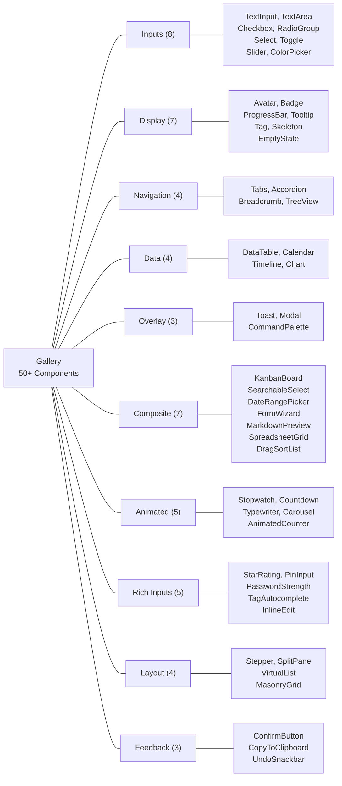
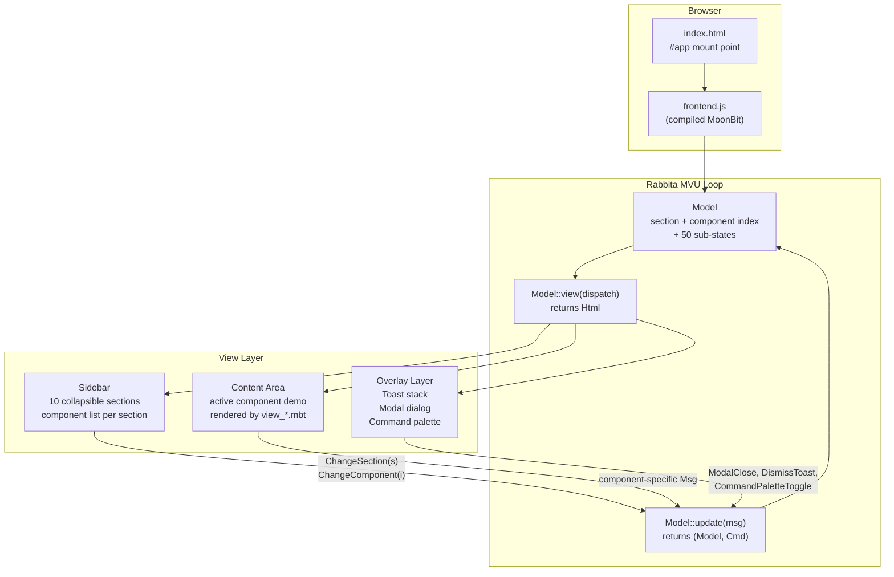

# UI Component Gallery

A comprehensive UI component showcase built entirely in [MoonBit](https://www.moonbitlang.com/) using the [Rabbita](https://github.com/moonbit-community/rabbita) framework. The gallery demonstrates 50+ interactive components organized into 10 sections, all rendered client-side with the Elm architecture (Model-Update-View).

- **Framework**: [Rabbita](https://github.com/moonbit-community/rabbita) (MVU frontend framework, compiles to JS)
- **Architecture**: Single-page app with sidebar navigation and live component demos
- **No backend**: Pure frontend -- served as static files via any HTTP server

## Quick Start

```bash
moon update
make serve
```

Open http://localhost:4010.

To open directly in the browser without a server:

```bash
make open
```

## Component Sections

### Inputs
Form input components for collecting user data.

| Component | Description |
|-----------|-------------|
| TextInput | Single-line text field with real-time validation |
| TextArea | Multi-line input with character count enforcement |
| Checkbox | Group of independently toggleable checkboxes |
| RadioGroup | Mutually exclusive radio button selection |
| Select | Dropdown select menu |
| Toggle | On/off toggle switches |
| Slider | Range slider for numeric value selection |
| ColorPicker | Color selection with preset swatches and hex entry |

### Display
Read-only visual components for presenting information.

| Component | Description |
|-----------|-------------|
| Avatar | User avatars with online status indicators |
| Badge | Notification badges with numeric counts |
| ProgressBar | Animated progress bar showing completion percentage |
| Tooltip | Hover-triggered supplementary information |
| Tag | Tag/chip list with add and remove |
| Skeleton | Shimmer loading placeholders |
| EmptyState | Placeholder illustration for empty data views |

### Navigation
Components for switching between views and showing location.

| Component | Description |
|-----------|-------------|
| Tabs | Tabbed panel switching between content views |
| Accordion | Collapsible panels showing one section at a time |
| Breadcrumb | Hierarchical location trail |
| TreeView | Expandable/collapsible tree of nested data |

### Data
Components for presenting structured data.

| Component | Description |
|-----------|-------------|
| DataTable | Sortable, paginated table with row selection |
| Calendar | Month-view calendar with day selection and today highlighting |
| Timeline | Vertical chronological event timeline |
| Chart | SVG bar chart visualization |

### Overlay
Layered elements appearing above the main content.

| Component | Description |
|-----------|-------------|
| Toast | Timed notification popups with severity levels |
| Modal | Confirmation dialog with accept/cancel actions |
| CommandPalette | Keyboard-driven Cmd+K action search |

### Composite
Multi-part components composed of several simpler widgets.

| Component | Description |
|-----------|-------------|
| KanbanBoard | Columned board with movable cards |
| SearchableSelect | Dropdown with type-ahead filtering and keyboard navigation |
| DateRangePicker | Start/end date selection with calendar |
| FormWizard | Multi-step form with per-step validation |
| MarkdownPreview | Live markdown editor with rendered preview |
| SpreadsheetGrid | Editable cell grid with selection and inline editing |
| DragSortList | Reorderable list via up/down controls |

### Animated
Components with time-based behavior.

| Component | Description |
|-----------|-------------|
| Stopwatch | Start/stop/reset elapsed time counter |
| Countdown | Configurable countdown timer |
| Typewriter | Text reveal animation, one character at a time |
| Carousel | Image/card slider with manual and auto navigation |
| AnimatedCounter | Smooth number transition animation |

### Rich Inputs
Specialized input components with enhanced interaction.

| Component | Description |
|-----------|-------------|
| StarRating | Clickable 1-5 star rating with hover preview |
| PinInput | Auto-advancing PIN code digit entry |
| PasswordStrength | Password field with real-time strength meter |
| TagAutocomplete | Tag input with suggestion dropdown |
| InlineEdit | Click-to-edit inline text fields |

### Layout
Structural components controlling element arrangement.

| Component | Description |
|-----------|-------------|
| Stepper | Numeric increment/decrement with bounds |
| SplitPane | Resizable two-panel layout with draggable divider |
| VirtualList | Virtualized list rendering only visible items |
| MasonryGrid | Variable-height cards distributed across columns |

### Feedback
Components that communicate action outcomes to the user.

| Component | Description |
|-----------|-------------|
| ConfirmButton | Two-click safety confirmation (arm then execute) |
| CopyToClipboard | One-click copy with visual feedback |
| UndoSnackbar | Snackbar notification with undo action |

## Project Structure

```
frontend/
  main.mbt              # Rabbita app entry point, mounts to #app
  app/
    types.mbt            # Section enum, all component state structs, Msg enum
    update.mbt           # Model::update() — message handling and state transitions
    styles.mbt           # CSS-in-MoonBit style constants
    view.mbt             # Top-level layout: sidebar + content + overlays
    view_inputs.mbt      # View functions for Input section components
    view_display.mbt     # View functions for Display section components
    view_navigation.mbt  # View functions for Navigation section components
    view_data.mbt        # View functions for Data section components
    view_overlay.mbt     # View functions for Overlay section components
    view_composite.mbt   # View functions for Composite section components
    view_animated.mbt    # View functions for Animated section components
    view_rich_inputs.mbt # View functions for Rich Inputs section components
    view_layout.mbt      # View functions for Layout section components
    view_feedback.mbt    # View functions for Feedback section components
    js_extern.mbt        # FFI bindings for browser APIs (clipboard, etc.)
    *_test.mbt           # Unit and end-to-end tests
public/
  index.html             # Static HTML shell with #app mount point
  frontend.js            # Build output (compiled MoonBit JS)
moon.mod.json            # Module config and dependencies
Makefile                 # Build and serve commands
```

## Architecture Diagrams

### Component Taxonomy



### Application Architecture


