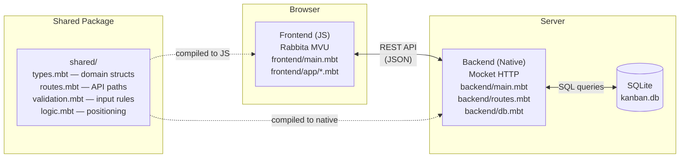
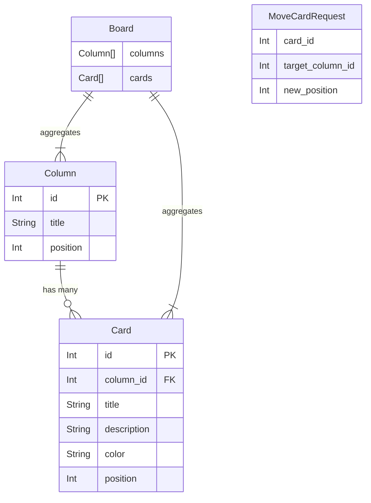
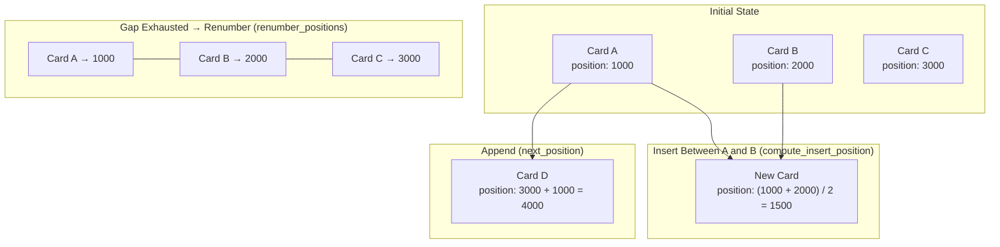
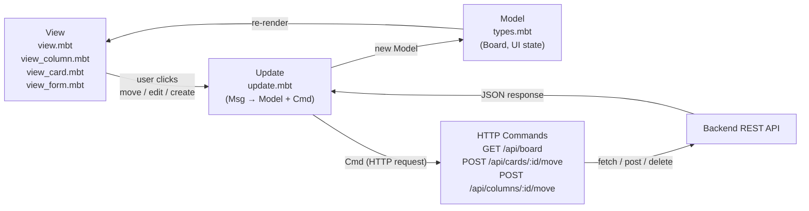

# Kanban Board

A full-stack Kanban board built with MoonBit demonstrating isomorphic code sharing between frontend and backend. The shared package contains positioning algorithms, validation rules, route definitions, and domain types used by both targets.

## Quick Start

```bash
make serve    # Build & run on http://localhost:4005
```

## Features

- **Columns**: Create, rename, reorder (left/right), delete columns
- **Cards**: Create with color labels, edit title/description/color, delete
- **Card movement**: Click-to-move cards between columns with visual drop zones
- **Fractional positioning**: Cards and columns use integer positions with gap-based insertion — no renumbering unless gaps are exhausted
- **Validation**: Shared limits enforced on both client and server (title length, max columns, max cards per column)
- **Color labels**: Six color options (red, orange, yellow, green, blue, purple) with shared CSS mapping

## Isomorphic Design

The `shared/` package compiles to both JS and native targets, providing:

| Shared Code | Purpose |
|---|---|
| `types.mbt` | `Board`, `Column`, `Card`, `MoveCardRequest` structs with JSON derive |
| `routes.mbt` | API path constants and builders (`api_board`, `api_card(id)`, etc.) |
| `validation.mbt` | Input validation (`validate_card_title`, `validate_color`, limits) |
| `logic.mbt` | Positioning algorithms (`compute_insert_position`, `compute_move_position`, `renumber_positions`, `cards_in_column`, `sort_by_position`, `color_to_css`) |

The positioning algorithm uses integer positions with a gap of 1000. New items append at `max + 1000`. Insertions between items use the midpoint. When the gap becomes too small (returns 0), the backend renumbers all items in the column with fresh evenly-spaced positions.

## API

| Method | Path | Description |
|---|---|---|
| GET | `/api/board` | Full board (columns + cards) |
| POST | `/api/columns` | Create column `{"title": "..."}` |
| GET | `/api/columns/:id` | Get a single column |
| POST | `/api/columns/:id` | Rename column `{"title": "..."}` |
| POST | `/api/columns/:id/move` | Move column `{"new_position": N}` |
| DELETE | `/api/columns/:id` | Delete column and its cards |
| POST | `/api/cards` | Create card `{"column_id": N, "title": "...", "description": "...", "color": "..."}` |
| POST | `/api/cards/:id` | Update card `{"title": "...", "description": "...", "color": "..."}` |
| POST | `/api/cards/:id/move` | Move card `{"target_column_id": N, "new_position": N}` |
| DELETE | `/api/cards/:id` | Delete card |

## Project Structure

```
kanban/
├── moon.mod.json          # Module: bobzhang/kanban
├── Makefile               # Build & serve (port 4005)
├── shared/                # Isomorphic package (js + native)
│   ├── types.mbt          # Board, Column, Card, MoveCardRequest
│   ├── routes.mbt         # API route constants
│   ├── validation.mbt     # Input validation & limits
│   ├── logic.mbt          # Positioning algorithms & helpers
│   ├── logic_test.mbt     # Tests for positioning logic
│   ├── validation_test.mbt # Tests for validation
│   ├── routes_test.mbt    # Tests for route builders
│   ├── types_test.mbt     # JSON round-trip tests
│   └── README.mbt.md      # Testable documentation
├── backend/               # Native target — Mocket + SQLite3
│   └── main.mbt
├── frontend/              # JS target — Rabbita MVU
│   └── main.mbt
└── public/
    └── frontend.js        # Compiled frontend (generated)
```

## Testing

```bash
moon test shared/          # Run shared package tests (50+ tests)
moon test shared/ -v       # Verbose with test names
```

## Architecture

### System Architecture

The frontend compiles to JS via MoonBit's JS target and communicates with the native backend over a REST API. The shared package compiles for both targets, providing types, validation, routes, and positioning logic used on each side.



### Data Model

Columns and cards use position-based ordering. A `Board` aggregates both. `MoveCardRequest` captures cross-column card moves.



### Position-Based Ordering

Items use integer positions with a fixed gap (`position_gap = 1000`). New items append at `max_position + 1000`. Inserting between two items uses the midpoint. When the gap shrinks to zero, the backend renumbers all items with fresh evenly-spaced positions.



### MVU Data Flow

The frontend follows the Elm architecture (Model-Update-View). Card move operations trigger HTTP commands that update the backend, and the response flows back through the update cycle.


