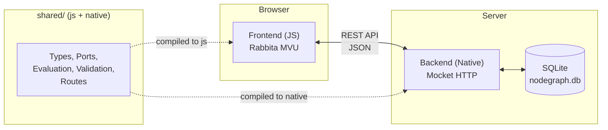
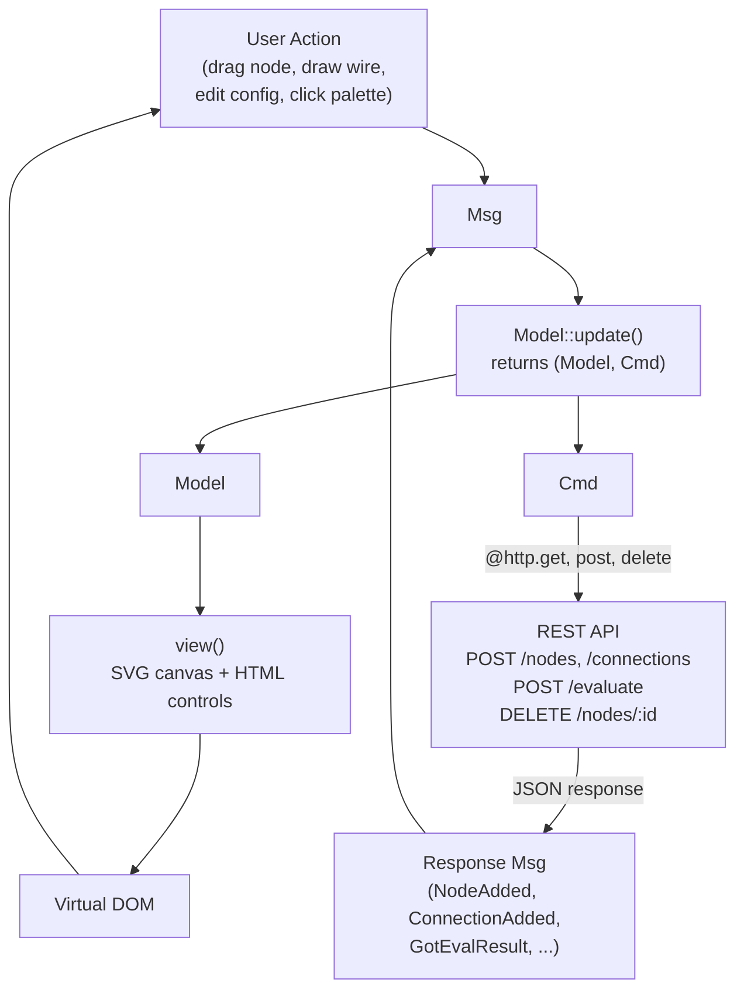
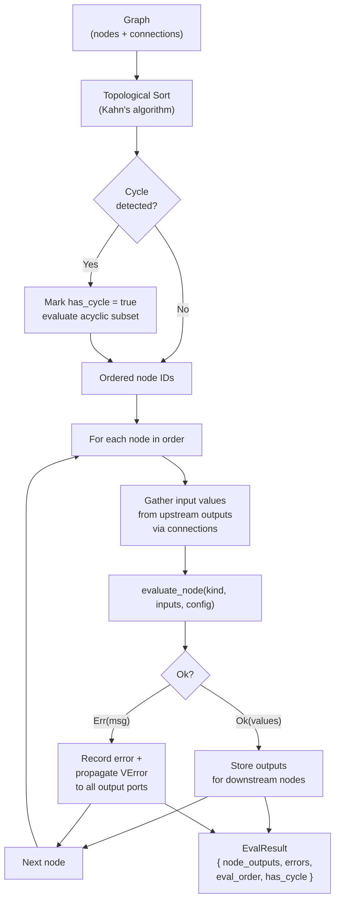
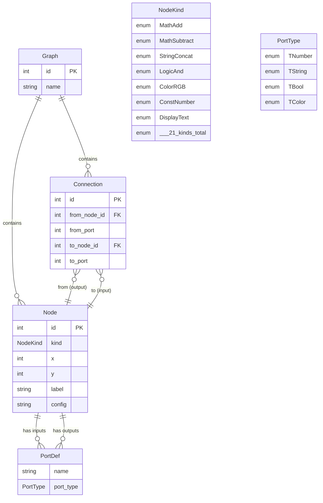

# NodeGraph

## Works only on nightly release

A visual node-based dataflow graph editor written entirely in [MoonBit](https://www.moonbitlang.com/), with isomorphic code shared between frontend and backend.

- **Frontend**: [Rabbita](https://github.com/moonbit-community/rabbita) (Elm-architecture UI framework, compiles to JS)
- **Backend**: [Mocket](https://github.com/oboard/mocket) (HTTP server, compiles to native) + [SQLite3](https://github.com/myfreess/sqlite3) (persistence)
- **Shared**: Node types, port definitions, graph evaluation, connection validation, and route paths compiled for both targets

## Quick Start

```bash
moon update
make serve
```

Open http://localhost:4008.

## Features

- **21 node kinds** across six categories: Math, String, Logic, Color, Constant, and Display
- **Typed port system** with four types (Number, String, Bool, Color) and strict type-checked connections
- **Visual wire dragging** to connect output ports to input ports with real-time feedback
- **Graph evaluation** via topological sort with cycle detection and error propagation
- **Auto-layout** using topological layering to arrange nodes left-to-right by dependency depth
- **Multiple graphs** with named save/load and a graph list page
- **Configurable constant nodes** with inline editing for Number, String, Bool, and Color values
- **Connection validation** enforced on both client and server: type compatibility, no self-loops, no duplicate inputs, no cycles
- **Demo graph** seeded on first launch to showcase evaluation out of the box
- **Data persists** in SQLite (`nodegraph.db`)

## Isomorphic Design

MoonBit compiles to multiple targets from the same source. This project uses three packages: `frontend/` targets JS, `backend/` targets native, and `shared/` has no target restriction so it compiles for both.

### What is shared

The `shared/` package contains code that both frontend and backend import:

- **Data types** (`types.mbt`) -- `Node`, `Connection`, `Graph`, `PortDef`, `Value`, `EvalResult`, and `SavedGraph` structs and enums with `derive(ToJson, FromJson)`. The backend constructs these from SQLite rows and serializes them to JSON. The frontend deserializes the same JSON into the same types. The JSON contract is enforced by the compiler, not by convention.

- **Node kinds and port definitions** (`ports.mbt`) -- `NodeKind` is an exhaustive enum of all 21 node behaviors. `input_ports()` and `output_ports()` return typed port definitions for each kind. Adding a new node kind forces handling in both ports and evaluation -- the compiler ensures nothing is missed.

- **Graph evaluation** (`graph.mbt`) -- `topological_sort()` (Kahn's algorithm), `evaluate_graph()`, and `evaluate_node()` live in shared code. The backend calls `evaluate_graph()` for the `/evaluate` endpoint; the frontend could call it directly for client-side preview. Same algorithm, one definition.

- **Connection validation** (`validation.mbt`) -- `validate_connection()` checks type compatibility, self-loops, duplicate input ports, and cycle detection. The frontend calls it before sending a request; the backend calls it before inserting. Same rules, enforced on both sides.

- **Route paths** (`routes.mbt`) -- API paths defined once. The frontend calls `@shared.api_graph_evaluate(id)` to build request URLs. The backend uses the same paths for route registration. Renaming an endpoint only requires changing one file.

### Why it matters

In a typical node editor, the frontend and backend would independently define what "MathAdd" means, what ports it has, and how to evaluate it. When they drift apart, you get phantom connections, wrong types, or silent evaluation errors.

With isomorphic MoonBit, `NodeKind` exists once. Add a new node kind and both sides see it immediately -- the frontend won't compile until its palette renders the new kind, and the backend won't compile until its evaluation handles it. Port definitions, type checking, and validation logic are written once and statically verified for both targets.

## API

| Method   | Path                              | Description                                     |
|----------|-----------------------------------|-------------------------------------------------|
| `GET`    | `/api/graphs`                     | List all saved graphs                           |
| `POST`   | `/api/graphs`                     | Create a graph (`{"name": "..."}`)              |
| `GET`    | `/api/graphs/:id`                 | Get a graph with all nodes and connections       |
| `DELETE` | `/api/graphs/:id`                 | Delete a graph                                  |
| `POST`   | `/api/graphs/:id/nodes`           | Create a node (`{"kind": "MathAdd"}`)           |
| `POST`   | `/api/graphs/:gid/nodes/:nid`     | Update node position or config                  |
| `DELETE` | `/api/graphs/:gid/nodes/:nid`     | Delete a node                                   |
| `POST`   | `/api/graphs/:id/connections`     | Create a connection (from/to node and port IDs) |
| `DELETE` | `/api/graphs/:gid/connections/:cid` | Delete a connection                           |
| `POST`   | `/api/graphs/:id/evaluate`        | Evaluate the graph and return all node outputs   |

## Project Structure

```
shared/                    # Isomorphic code (both js and native)
  types.mbt                #   Node, Connection, Graph, Value, EvalResult structs
  ports.mbt                #   NodeKind enum, input/output port definitions, categories
  graph.mbt                #   Topological sort, graph evaluation, node evaluation
  validation.mbt           #   Connection validation, graph name validation, limits
  routes.mbt               #   API path constants and builders
backend/
  main.mbt                 #   Mocket HTTP server, HTML shell, REST API routes
  db.mbt                   #   SQLite3 schema, CRUD operations, demo seed data
frontend/
  main.mbt                 #   Rabbita app bootstrap
  app/
    types.mbt              #   Model, Msg, Page types for MVU state
    update.mbt             #   Message handling, HTTP commands, state transitions
    view.mbt               #   Top-level view dispatch (list vs editor)
    view_editor.mbt        #   Editor canvas: SVG connections, node grid, toolbar
    view_node.mbt          #   Individual node rendering with ports and values
    view_connections.mbt   #   SVG connection lines and active wire preview
    view_palette.mbt       #   Node palette grouped by category
    layout.mbt             #   Auto-layout computation (topological layering)
public/                    #   Build output for frontend JS
moon.mod.json              #   Module config and dependencies
Makefile                   #   Build and run commands
```

## Architecture Diagrams

### System Architecture



### MVU Data Flow



### Node Evaluation Pipeline



### Data Model


