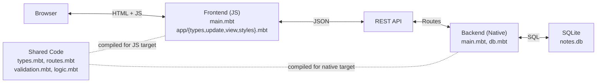
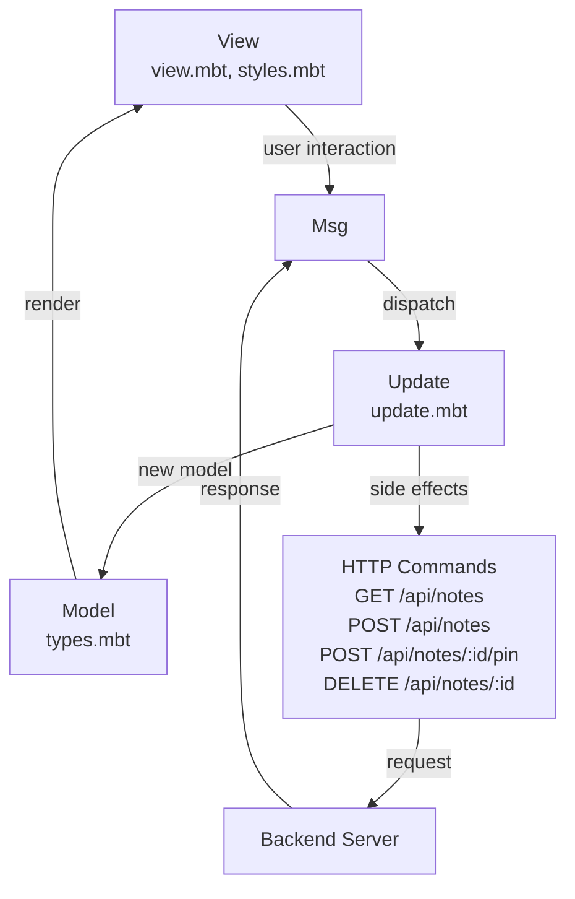
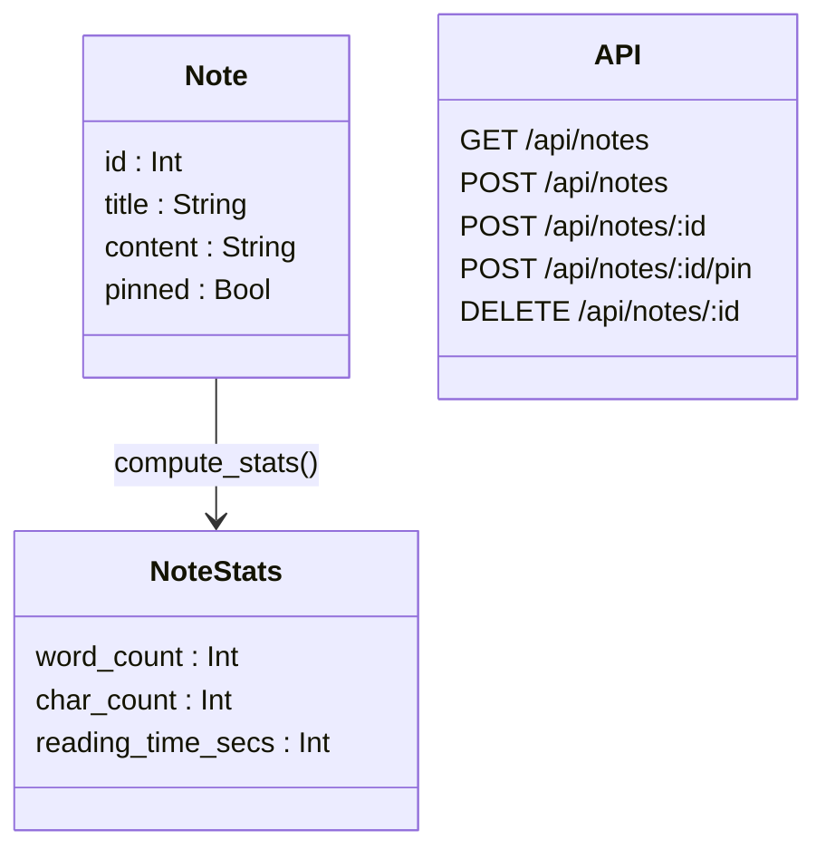

# Notes

A full-stack note-taking application written entirely in [MoonBit](https://www.moonbitlang.com/), with isomorphic code shared between frontend and backend.

- **Frontend**: [Rabbita](https://github.com/moonbit-community/rabbita) (Elm-architecture UI framework, compiles to JS)
- **Backend**: [Mocket](https://github.com/oboard/mocket) (HTTP server, compiles to native) + [SQLite3](https://github.com/myfreess/sqlite3) (persistence)
- **Shared**: Common types, routes, validation, and statistics logic compiled for both targets

## Quick Start

```bash
moon update
make serve
```

Open http://localhost:4003.

## Features

- Create notes with title and content
- Pin/unpin important notes (pinned notes appear first)
- Note statistics: word count, character count, estimated reading time
- Note list with content preview and word count badges
- Delete notes
- Input validation (title: 1-100 chars, content: 1-5000 chars)
- Data persists in SQLite (`notes.db`)
- Single codebase, two compilation targets (`js` for frontend, `native` for backend)

## Isomorphic Design

MoonBit compiles to multiple targets from the same source. This project uses three packages: `frontend/` targets JS, `backend/` targets native, and `shared/` has no target restriction so it compiles for both.

### What is shared

The `shared/` package contains code that both frontend and backend import:

- **`Note` and `NoteStats` types** (`types.mbt`) — structs with `derive(ToJson, FromJson)`. The backend constructs `Note` values from SQLite rows and serializes them. The frontend deserializes the same JSON into the same type.

- **Route paths** (`routes.mbt`) — API paths defined once. The frontend calls `@shared.api_note_pin(id)` to build request URLs. The backend uses `@shared.api_notes` for route registration.

- **Validation** (`validation.mbt`) — `validate_title()` and `validate_content()` enforce length limits. Same rules, one definition, enforced on both sides.

- **Statistics and sorting** (`logic.mbt`) — `compute_stats()` calculates word count, character count, and reading time. `truncate_preview()` generates content previews. `sort_notes()` orders pinned notes first. The same logic runs on both targets.

## API

| Method | Path | Description |
|--------|------|-------------|
| `GET` | `/api/notes` | List all notes (pinned first, then newest) |
| `POST` | `/api/notes` | Create a note (`{"title": "...", "content": "..."}`) |
| `POST` | `/api/notes/:id/pin` | Toggle pin status |
| `DELETE` | `/api/notes/:id` | Delete a note |

## Project Structure

```
shared/              # Isomorphic code (both js and native)
  types.mbt          #   Note and NoteStats structs with ToJson/FromJson
  routes.mbt         #   API path constants and builders
  validation.mbt     #   Title and content length validation
  logic.mbt          #   Statistics, preview truncation, sorting
backend/main.mbt     # Mocket HTTP server + SQLite3 CRUD
frontend/main.mbt    # Rabbita MVU app (model, update, view)
public/              # Build output for frontend JS
moon.mod.json        # Module config and dependencies
Makefile             # Build and run commands
```

## Architecture

### System Architecture



### MVU Data Flow



### Data Model


