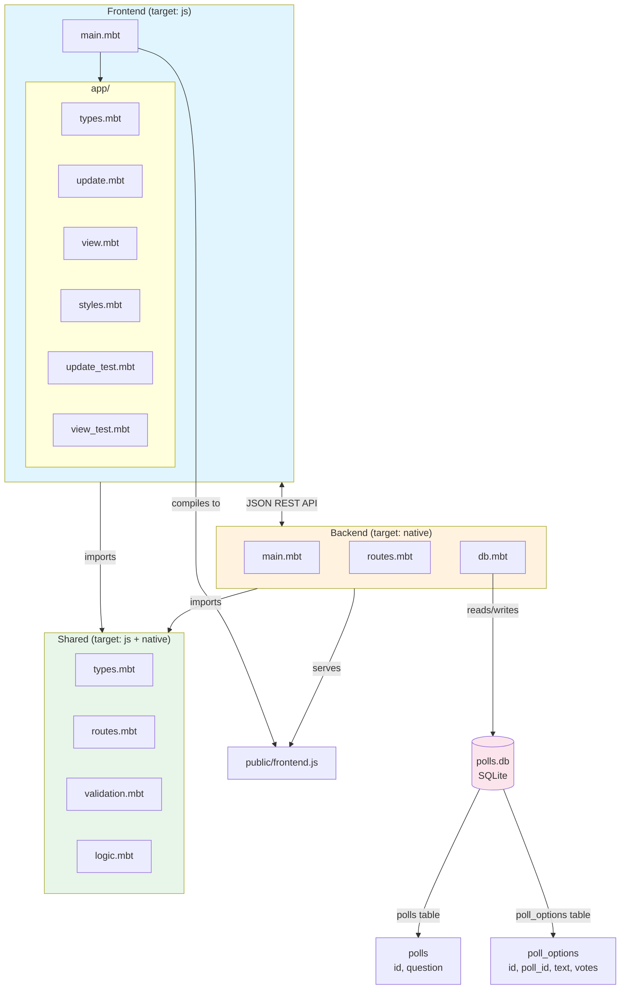
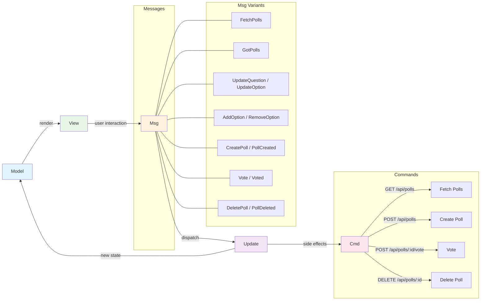
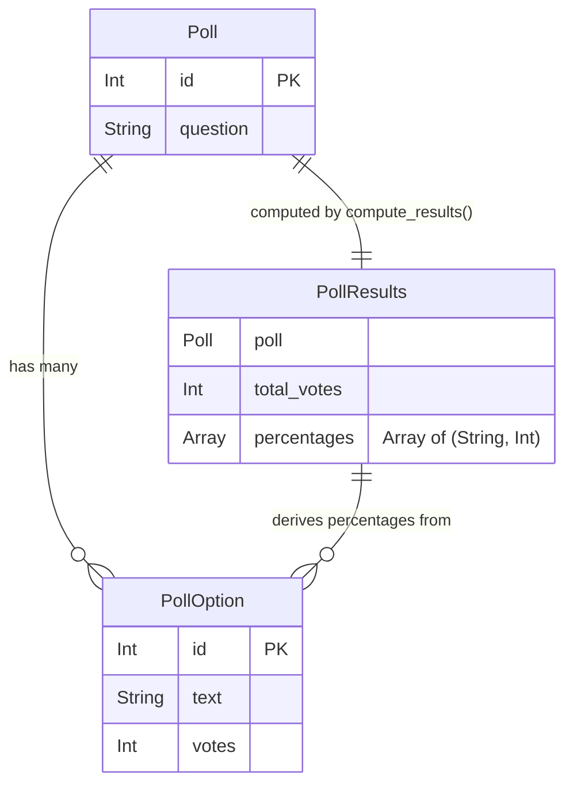

# Polls

A full-stack polling application written entirely in [MoonBit](https://www.moonbitlang.com/), with isomorphic code shared between frontend and backend.

- **Frontend**: [Rabbita](https://github.com/moonbit-community/rabbita) (Elm-architecture UI framework, compiles to JS)
- **Backend**: [Mocket](https://github.com/oboard/mocket) (HTTP server, compiles to native) + [SQLite3](https://github.com/myfreess/sqlite3) (persistence)
- **Shared**: Common types, routes, validation, and vote computation compiled for both targets

## Quick Start

```bash
moon update
make serve
```

Open http://localhost:4002.

## Features

- Create polls with a question and 2-6 multiple choice options
- Vote on poll options (client-side duplicate vote prevention)
- View vote results with counts and percentages
- Delete polls
- Data persists in SQLite (`polls.db`)
- Single codebase, two compilation targets (`js` for frontend, `native` for backend)

## Isomorphic Design

MoonBit compiles to multiple targets from the same source. This project uses three packages: `frontend/` targets JS, `backend/` targets native, and `shared/` has no target restriction so it compiles for both.

### What is shared

The `shared/` package contains code that both frontend and backend import:

- **`Poll`, `PollOption`, and `PollResults` types** (`types.mbt`) — structs with `derive(ToJson, FromJson)`. The backend constructs `Poll` values from SQLite rows (joining polls and poll_options tables). The frontend deserializes the same JSON into the same types.

- **Route paths** (`routes.mbt`) — API paths defined once. The frontend calls `@shared.api_poll_vote(id)` to build request URLs. The backend uses `@shared.api_polls` for route registration.

- **Validation** (`validation.mbt`) — `validate_question()` and `validate_option()` enforce length limits. `min_options` and `max_options` constants define the allowed range. Same rules, one definition, enforced on both sides.

- **Vote computation** (`logic.mbt`) — `compute_results()` calculates total votes and per-option percentages from a `Poll`. The same calculation runs on both targets.

## API

| Method | Path | Description |
|--------|------|-------------|
| `GET` | `/api/polls` | List all polls with options and vote counts |
| `POST` | `/api/polls` | Create a poll (`{"question": "...", "options": ["...", ...]}`) |
| `POST` | `/api/polls/:id/vote` | Vote on an option (`{"option_id": 1}`) |
| `DELETE` | `/api/polls/:id` | Delete a poll |

## Project Structure

```
shared/              # Isomorphic code (both js and native)
  types.mbt          #   Poll, PollOption, PollResults with ToJson/FromJson
  routes.mbt         #   API path constants and builders
  validation.mbt     #   Question/option length, option count limits
  logic.mbt          #   Vote counting and percentage computation
backend/main.mbt     # Mocket HTTP server + SQLite3 CRUD (polls + poll_options)
frontend/main.mbt    # Rabbita MVU app (model, update, view)
public/              # Build output for frontend JS
moon.mod.json        # Module config and dependencies
Makefile             # Build and run commands
```

## Architecture

### System Architecture



### MVU Data Flow



### Data Model


