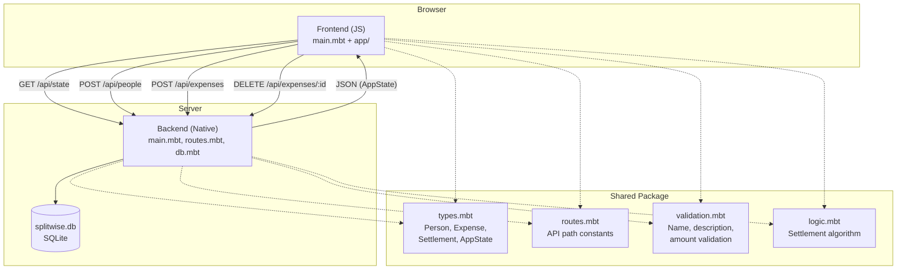
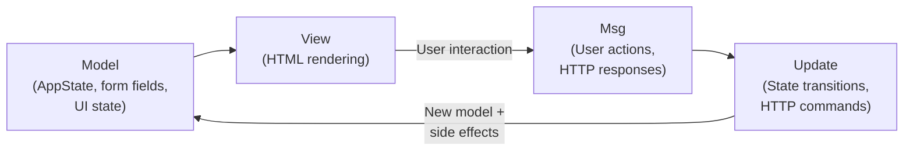
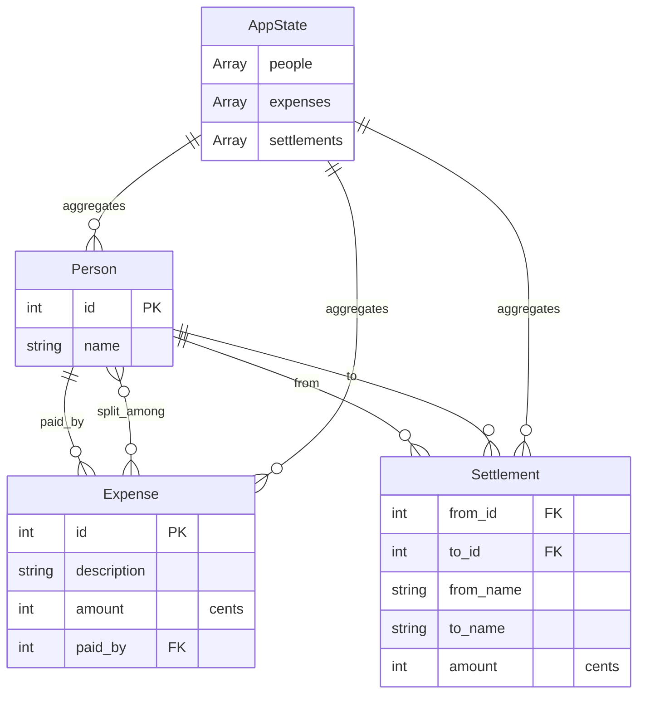
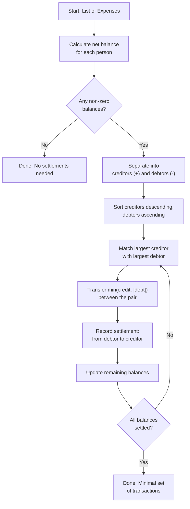

# Splitwise

A full-stack expense-splitting application written entirely in [MoonBit](https://www.moonbitlang.com/), with isomorphic code shared between frontend and backend.

- **Frontend**: [Rabbita](https://github.com/moonbit-community/rabbita) (Elm-architecture UI framework, compiles to JS)
- **Backend**: [Mocket](https://github.com/oboard/mocket) (HTTP server, compiles to native) + [SQLite3](https://github.com/myfreess/sqlite3) (persistence)
- **Shared**: Common types, routes, validation, and settlement algorithm compiled for both targets

## Quick Start

```bash
moon update
make serve
```

Open http://localhost:4001.

## Features

- Add people to a group
- Record shared expenses with description, amount, payer, and split participants
- Automatically split expenses equally among participants
- Compute minimal settlement transactions (who owes whom)
- Delete expenses and recalculate settlements
- Dollar-to-cents precision for monetary handling
- Data persists in SQLite (`splitwise.db`)
- Single codebase, two compilation targets (`js` for frontend, `native` for backend)

## Isomorphic Design

MoonBit compiles to multiple targets from the same source. This project uses three packages: `frontend/` targets JS, `backend/` targets native, and `shared/` has no target restriction so it compiles for both.

### What is shared

The `shared/` package contains code that both frontend and backend import:

- **`Person`, `Expense`, `Settlement`, and `AppState` types** (`types.mbt`) — structs with `derive(ToJson, FromJson)`. The backend constructs values from SQLite rows (joining expenses and expense_splits tables). The frontend deserializes the same JSON. Amounts are stored in cents (integers) to avoid floating-point rounding.

- **Route paths** (`routes.mbt`) — API paths defined once. The frontend calls `@shared.api_expense(id)` to build request URLs. The backend uses `@shared.api_people` and `@shared.api_expenses` for route registration.

- **Validation** (`validation.mbt`) — `validate_name()` and `validate_description()` enforce length limits. `validate_amount()` ensures amounts are positive. Same rules, one definition, enforced on both sides.

- **Settlement algorithm** (`logic.mbt`) — `compute_balances()` calculates each person's net balance from all expenses. `compute_settlements()` uses a greedy algorithm to find the minimum number of transactions needed to settle all debts. `format_amount()` converts cents to display format. The same algorithm runs on both targets.

### Why it matters

The settlement algorithm is the core business logic of this app. Because it lives in the shared package, the frontend can show settlements instantly (computed client-side) while the backend can independently verify them. If the algorithm changes, both sides update atomically — no version mismatch between what the UI shows and what the server computes.

## API

| Method | Path | Description |
|--------|------|-------------|
| `GET` | `/api/state` | Fetch all people, expenses, and computed settlements |
| `POST` | `/api/people` | Add a person (`{"name": "..."}`) |
| `POST` | `/api/expenses` | Create an expense (`{"description": "...", "amount": 3050, "paid_by": 1, "split_among": [1, 2]}`) |
| `DELETE` | `/api/expenses/:id` | Delete an expense |

## Project Structure

```
shared/              # Isomorphic code (both js and native)
  types.mbt          #   Person, Expense, Settlement, AppState with ToJson/FromJson
  routes.mbt         #   API path constants and builders
  validation.mbt     #   Name, description, amount validation
  logic.mbt          #   Balance computation, greedy settlement algorithm, formatting
backend/
  main.mbt           # Mocket HTTP server entry point
  routes.mbt         # Route registration and handlers
  db.mbt             # SQLite3 CRUD (people, expenses, expense_splits)
frontend/
  main.mbt           # Rabbita app entry point
  app/
    types.mbt         # Model, Msg types
    update.mbt        # Update logic and HTTP commands
    view.mbt          # HTML view functions
    styles.mbt        # CSS-in-MoonBit styles
    update_test.mbt   # Update function tests
    view_test.mbt     # View function tests
public/              # Build output for frontend JS
moon.mod.json        # Module config and dependencies
Makefile             # Build and run commands
```

## Architecture

### System Architecture



### MVU Data Flow



### Data Model



### Settlement Algorithm


