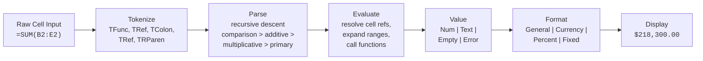
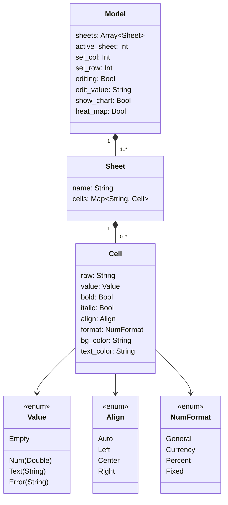
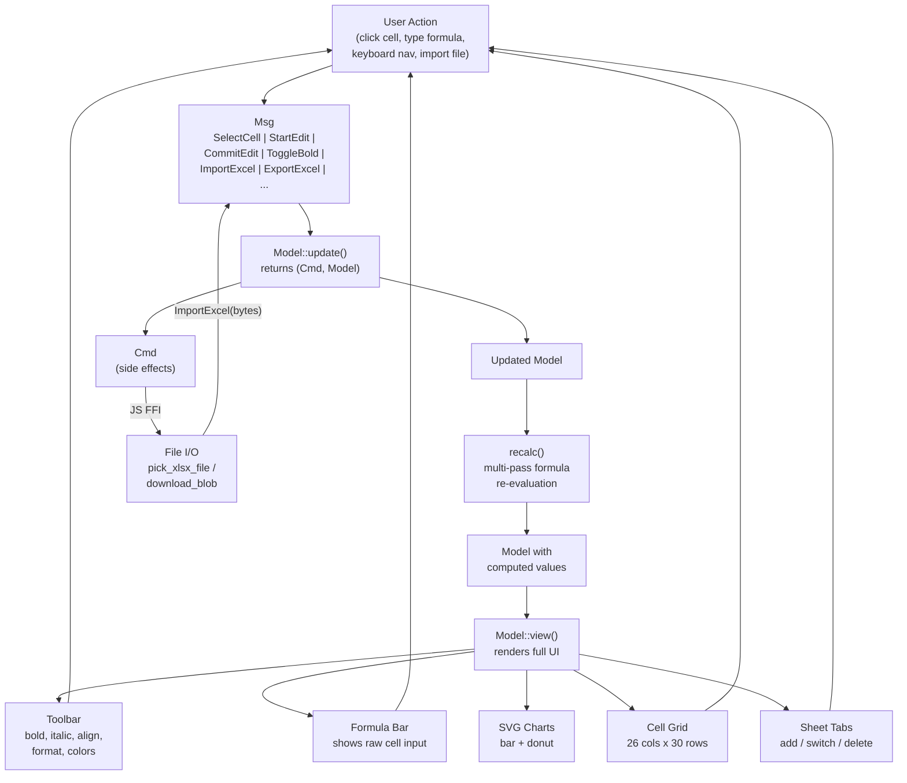

# Spreadsheet

An Excel-like spreadsheet application written entirely in [MoonBit](https://www.moonbitlang.com/), running fully in the browser. Features formula evaluation, cell styling, SVG charts, heat maps, multi-sheet support, and xlsx import/export.

- **Frontend**: [Rabbita](https://github.com/moonbit-community/rabbita) (Elm-architecture UI framework, compiles to JS)
- **Excel I/O**: [mbtexcel](https://github.com/nicholasgasior/mbtexcel) (xlsx parsing and generation in MoonBit)

No backend required -- the entire application runs client-side.

## Quick Start

```bash
moon update
make serve
```

Open http://localhost:4012. Or open the HTML file directly:

```bash
make open
```

## Features

- **Formula engine** -- arithmetic (`+`, `-`, `*`, `/`), cell references (`A1`, `B2:E6`), and functions:
  - Aggregation: `SUM`, `AVG`/`AVERAGE`, `MIN`, `MAX`, `COUNT`
  - Math: `ABS`, `ROUND`, `POWER`, `MOD`, `INT`
  - Logic: `IF(cond, true_val, false_val)` with comparisons (`>`, `<`, `>=`, `<=`, `=`)
  - String: `CONCAT`, `LEN`, `UPPER`, `LOWER`
- **Cell styling** -- bold, italic, text alignment (left/center/right/auto), background and text colors
- **Number formats** -- General, Currency (`$1,234.56`), Percent (`45.2%`), Fixed (`1234.56`)
- **SVG charts** -- bar chart and donut chart rendered from sheet data, with animated transitions
- **Heat map mode** -- color-codes numeric cells by relative value
- **Multi-sheet** -- tabbed sheets with add/delete/rename, each with an independent 26x30 cell grid (A-Z columns)
- **XLSX import** -- open `.xlsx` files via browser file picker; parses sheets, cell values, and formulas
- **XLSX export** -- download the current workbook as a `.xlsx` file
- **Keyboard navigation** -- arrow keys, Enter to edit, Escape to cancel, Tab to move

## Project Structure

```
frontend/
  main.mbt              # Entry point: mounts the Rabbita app
  app/
    types.mbt            # Model, Sheet, Msg definitions
    update.mbt           # Message handling + recalc engine
    view.mbt             # Toolbar, formula bar, grid, sheet tabs, status bar
    view_chart.mbt       # SVG bar chart + donut chart rendering
    import.mbt           # XLSX import/export via mbtexcel + JS FFI
  cell/
    cell.mbt             # Cell, Value, Align, NumFormat types + formatting
  formula/
    formula.mbt          # Tokenizer, recursive-descent parser, evaluator
public/
  index.html             # Shell HTML page
  frontend.js            # Build output (compiled MoonBit JS)
moon.mod.json            # Module config and dependencies
Makefile                 # Build and run commands
```

## Architecture Diagrams

### Formula Evaluation Pipeline



### Data Model



### MVU Architecture


