# TaskFlow

A full-stack task management application written entirely in [MoonBit](https://www.moonbitlang.com/), demonstrating isomorphic code sharing between frontend and backend through dual compilation targets.

## Quick Start

```bash
make serve          # Build + run on http://localhost:4006
make build          # Build both targets without running
moon test           # Run all 166 unit tests
moon run cli --target native  # Run CLI integration tests (needs running server + clean DB)
```

## Architecture Overview

TaskFlow compiles from one MoonBit codebase into two targets:

- **Frontend** (target: `js`) — compiles to JavaScript, runs in the browser
- **Backend** (target: `native`) — compiles to native binary, runs as HTTP server

A **shared** package contains types, validation, business logic, and i18n that both targets use at compile time — the same struct definitions and derive macros produce matching JSON serialization on both sides automatically.

```mermaid
graph TB
    subgraph "MoonBit Source"
        shared["shared/<br/>types, validation, status FSM,<br/>i18n, routes, business logic"]
        frontend["frontend/<br/>Rabbita MVU app<br/>(target: js)"]
        backend["backend/<br/>Mocket HTTP server<br/>(target: native)"]
        cli["cli/<br/>Integration test client<br/>(target: native)"]
    end

    shared --> frontend
    shared --> backend
    shared --> cli

    subgraph "Compiled Output"
        js["frontend.js"]
        bin["taskflow server binary"]
        cli_bin["test client binary"]
    end

    frontend -->|"moon build &#45;&#45;target js"| js
    backend -->|"moon build &#45;&#45;target native"| bin
    cli -->|"moon build &#45;&#45;target native"| cli_bin

    subgraph "Runtime"
        browser["Browser"]
        server["HTTP Server :4006"]
        db["SQLite taskflow.db"]
    end

    bin --> server
    server -->|"serves"| js
    js --> browser
    browser <-->|"JSON REST API"| server
    server <--> db
    cli_bin -->|"HTTP requests"| server
```

## Request Lifecycle

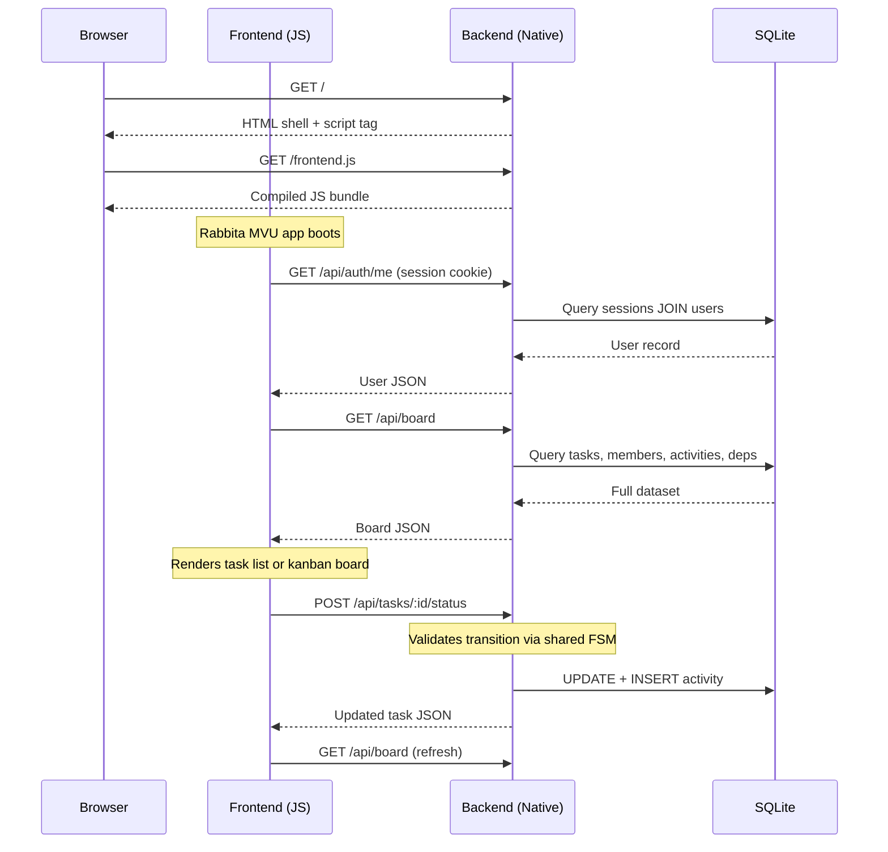

## Task State Machine

Status transitions are defined in `shared/status.mbt` and enforced on both sides: the frontend only renders valid transition buttons, and the backend rejects invalid transitions with 400.

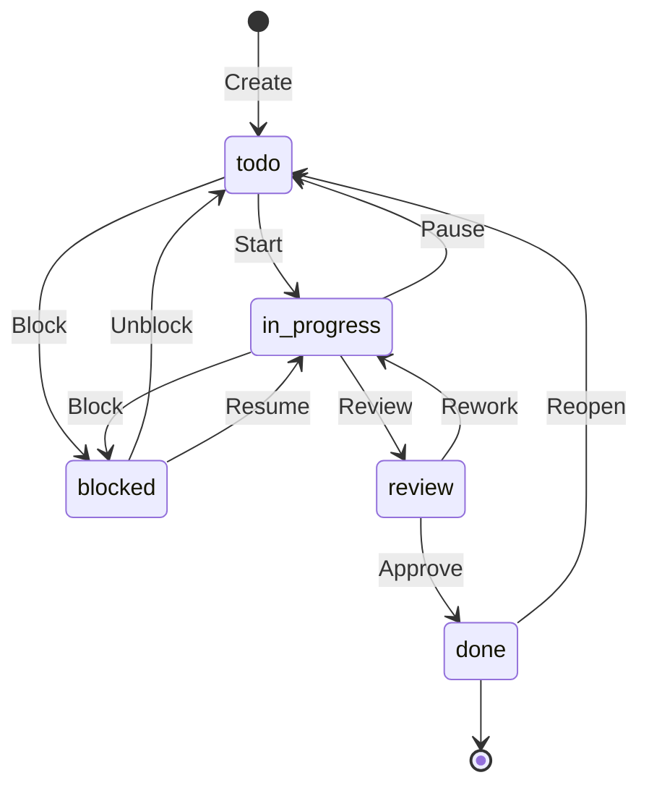

## Project Structure

```
taskflow/
├── moon.mod.json              # Module: bobzhang/taskflow
├── Makefile                   # Build & serve (port 4006)
├── shared/                    # Isomorphic package (js + native)
│   ├── types.mbt              # Task, User, Member, Board, Activity, Comment, Dependency
│   ├── status.mbt             # Status FSM: transitions, labels, colors
│   ├── logic.mbt              # Sorting, filtering, progress, deadlines, search
│   ├── validation.mbt         # Username/password/title/date validation
│   ├── routes.mbt             # API route constants shared by frontend & backend
│   ├── i18n.mbt               # Internationalization (En/Zh) with 70+ keys
│   ├── *_test.mbt             # Unit tests for each module
│   └── integration_test.mbt   # Cross-module integration tests
├── backend/                   # Native target
│   ├── main.mbt               # HTTP server setup, starts Mocket on :4006
│   ├── db.mbt                 # SQLite schema init + CRUD queries (15 tables)
│   ├── routes.mbt             # REST API route handlers (30+ endpoints)
│   └── auth.mbt               # Password hashing, sessions, user management
├── frontend/                  # JS target
│   ├── main.mbt               # Rabbita bootstrap, JS externs (drag-drop, localStorage)
│   └── app/                   # MVU sub-package
│       ├── types.mbt          # Model, Msg (50+ variants), Theme
│       ├── update.mbt         # Model::update — state transitions + HTTP commands
│       ├── view.mbt           # Model::view — root view dispatcher
│       └── update_test.mbt    # Snapshot tests for update logic
├── cli/                       # Native target
│   └── main.mbt               # 17-suite integration test client
└── public/
    └── frontend.js            # Compiled frontend (generated)
```

## Shared Package

The shared package is the core of the isomorphic design. It compiles to both JS and native, guaranteeing frontend and backend always agree on types, rules, and validation.

| File | Exports |
|------|---------|
| `types.mbt` | `User`, `Task`, `Member`, `Activity`, `Comment`, `Dependency`, `Board`, `AuthResponse` — all with `derive(ToJson, FromJson)` |
| `status.mbt` | `allowed_transitions()`, `is_valid_transition()`, `is_terminal()`, `status_label()`, `status_color()`, `transition_label()` |
| `logic.mbt` | `filter_tasks()`, `sort_tasks()`, `completion_percent()`, `search_matches()`, `matches_urgency()`, `has_unresolved_deps()` |
| `validation.mbt` | `validate_username()`, `validate_password()`, `validate_task_title()`, `validate_due_date()`, `validate_status()`, `validate_priority()` |
| `routes.mbt` | `api_login`, `api_register`, `api_board`, `api_task(id)`, `api_task_status(id)`, `api_task_comments(id)`, `api_task_deps(id)` |
| `i18n.mbt` | `Lang { En; Zh }`, `t(lang, key)`, `t_status()`, `t_priority()`, `t_transition()`, `t_urgency()`, `t_activity()`, `t_server_error()` |

## Frontend MVU Architecture

The frontend uses the [Rabbita](https://github.com/moonbit-community/rabbita) framework (Elm architecture):

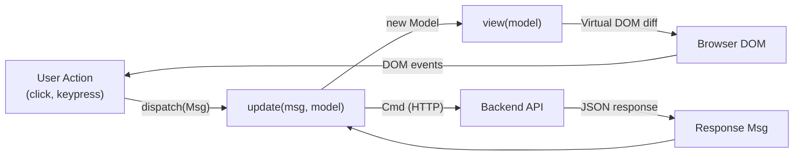

### Model

The `Model` struct holds all application state:

| Group | Fields |
|-------|--------|
| Auth | `current_user`, `auth_screen`, `auth_username`, `auth_password`, `auth_error`, `auth_loading` |
| Board data | `tasks`, `members`, `activities`, `dependencies`, `today` |
| Filters | `filter_status`, `filter_assignee`, `filter_priority`, `search_query`, `filter_urgency`, `view_mode`, `dark_mode` |
| Task forms | `adding_task`, `new_title`, `new_desc`, `new_priority`, `editing_task`, `edit_title`, ... |
| UI state | `viewing_comments`, `comments`, `confirm_delete`, `error_msg`, `loading`, `lang` |

### View Components

| Component | Description |
|-----------|-------------|
| `view_auth` | Login/register screen with language toggle |
| `view_header` | Top bar: user info, nav tabs (List/Board), dark mode, language, logout |
| `view_filters` | Filter bar: status, priority, assignee, urgency, text search |
| `view_task_item` | Task card in list view with transitions, deps, edit/delete actions |
| `view_kanban` | Board view with columns per status |
| `view_kanban_card` | Compact task card for kanban columns |
| `view_add_task_form` | Modal: title, description, priority, assignee, due date |
| `view_edit_task_form` | Inline task editor |
| `view_comments_panel` | Slide-in notes panel with comment list and input |
| `view_activity_feed` | Recent status changes with user attribution |
| `view_delete_confirm` | Confirmation modal |
| `view_error_toast` | Dismissible error notification |

### Keyboard Shortcuts

| Key | Action |
|-----|--------|
| `n` | New task |
| `l` | List view |
| `b` | Board view |
| `d` | Toggle dark mode |
| `Esc` | Close modals |

## Backend

### HTTP Server

Built with [Mocket](https://github.com/oboard/mocket) framework. Serves the HTML shell at `/`, the compiled JS at `/frontend.js`, and the REST API under `/api/`.

### Authentication Flow

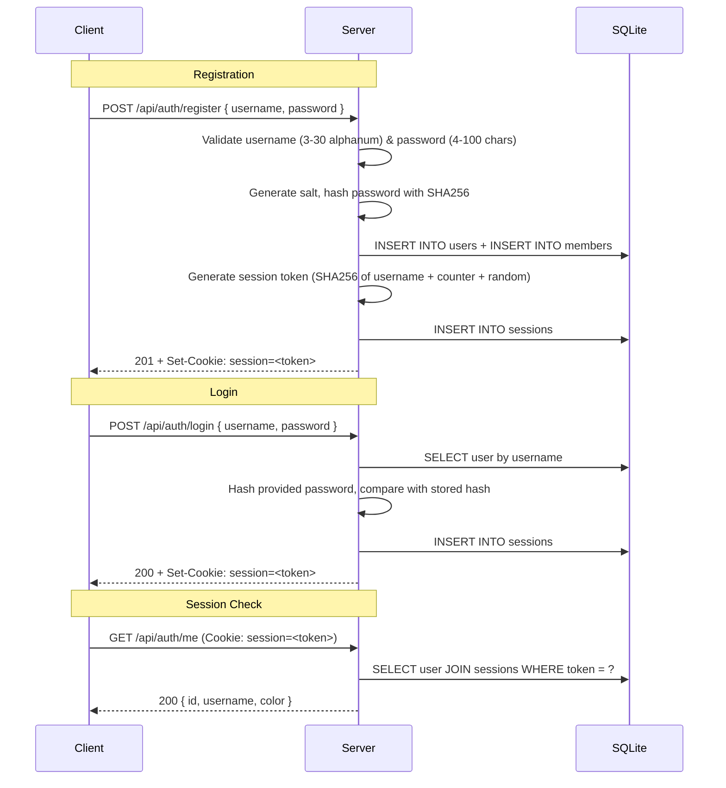

### Database Schema

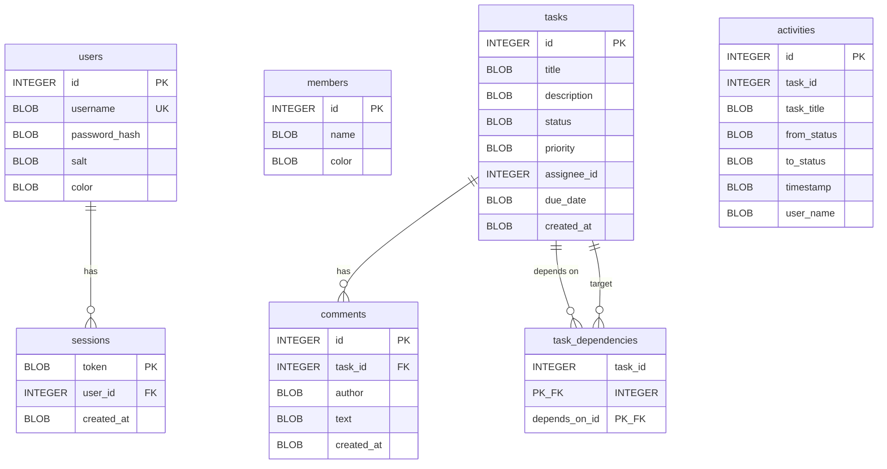

All text columns use `BLOB` type with `bind_string_as_blob` / `column_blob_as_string` for correct UTF-8 handling — this prevents garbled non-ASCII characters (Chinese, emoji, etc.).

## REST API Reference

### Authentication

| Method | Endpoint | Body | Response |
|--------|----------|------|----------|
| `POST` | `/api/auth/register` | `{ username, password }` | `201 { user, message }` + Set-Cookie |
| `POST` | `/api/auth/login` | `{ username, password }` | `200 { user, message }` + Set-Cookie |
| `POST` | `/api/auth/logout` | — | `200` + Delete-Cookie |
| `GET` | `/api/auth/me` | — | `200 { id, username, color }` |

### Board & Members

| Method | Endpoint | Response |
|--------|----------|----------|
| `GET` | `/api/board` | `{ tasks, members, activities, dependencies, today }` |
| `GET` | `/api/members` | `[{ id, name, color }]` |

### Tasks

| Method | Endpoint | Body | Response |
|--------|----------|------|----------|
| `POST` | `/api/tasks` | `{ title, description?, priority?, assignee_id?, due_date? }` | `201 Task` |
| `GET` | `/api/tasks/:id` | — | `200 Task` |
| `POST` | `/api/tasks/:id` | `{ title, description?, priority?, assignee_id?, due_date? }` | `200 Task` |
| `DELETE` | `/api/tasks/:id` | — | `204` |
| `POST` | `/api/tasks/:id/status` | `{ status }` | `200 Task` (validates FSM) |

### Comments & Dependencies

| Method | Endpoint | Body | Response |
|--------|----------|------|----------|
| `GET` | `/api/tasks/:id/comments` | — | `[Comment]` |
| `POST` | `/api/tasks/:id/comments` | `{ text }` | `201 Comment` |
| `GET` | `/api/tasks/:id/deps` | — | `[Dependency]` |
| `POST` | `/api/tasks/:id/deps` | `{ depends_on_id }` | `201 Dependency` |
| `POST` | `/api/tasks/:id/deps/remove` | `{ depends_on_id }` | `200` |

## Internationalization

TaskFlow supports English and Chinese with a modular i18n system in the shared package:

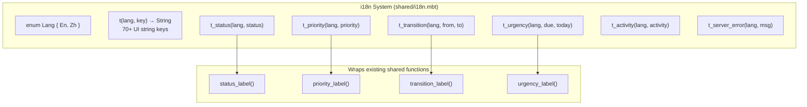

Adding a new language: add a variant to `Lang`, then add match arms in each `t_*` function. The `(_, key) => ...` fallback ensures English is always the default.

## Features

- **Task CRUD**: Create, edit, delete tasks with title, description, priority, assignee, due date
- **Status workflow**: Tasks follow a validated state machine (To Do, In Progress, Review, Done, Blocked)
- **Two views**: List view and Kanban board with drag-and-drop between status columns
- **Filtering**: By status, priority, assignee, urgency, and text search — all combinable
- **Task dependencies**: Link tasks with depends-on relationships; blocked indicators shown
- **Comments/notes**: Per-task comment threads
- **Activity tracking**: Status changes logged with user attribution
- **Progress tracking**: Completion percentage and per-status counts
- **Dark mode**: Full theme support with keyboard toggle
- **i18n**: English/Chinese with language toggle on both auth and main screens
- **Shared validation**: Username, password, title, description, date format — validated on both frontend and backend
- **Session auth**: SHA256 password hashing, HTTP-only session cookies

## Dependencies

| Package | Version | Target | Purpose |
|---|---|---|---|
| `moonbit-community/rabbita` | 0.11.5 | js | MVU framework + HTML DSL + HTTP client |
| `oboard/mocket` | 0.6.10 | native | HTTP server with CORS middleware |
| `myfreess/sqlite3` | 0.1.1 | native | SQLite3 bindings |
| `moonbitlang/x` | 0.4.40 | native | Filesystem (`@fs`) |
| `moonbitlang/async` | 0.16.8 | native | Async runtime for CLI tests |

## Architecture

### System Architecture

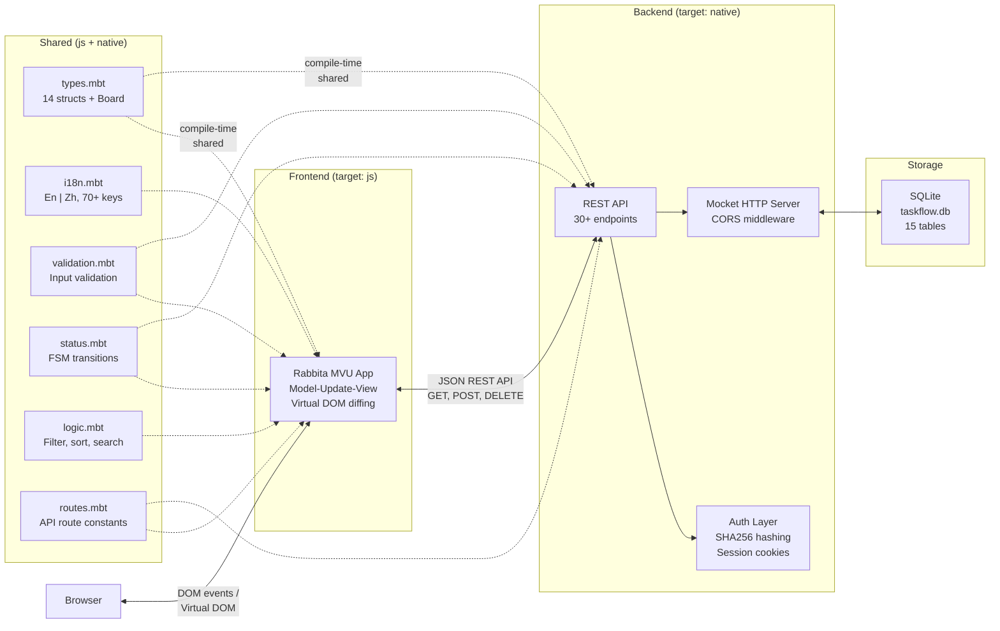

### Data Model

```mermaid
erDiagram
    User {
        Int id PK
        String username UK
        String password_hash
        String salt
        String color
        String role "admin | member | viewer"
    }

    Member {
        Int id PK
        String name
        String color
    }

    Task {
        Int id PK
        String title
        String description
        String status "todo | in_progress | review | done | blocked"
        String priority "low | medium | high | urgent"
        Int assignee_id FK
        String due_date
        String created_at
    }

    Activity {
        Int id PK
        Int task_id FK
        String task_title
        String from_status
        String to_status
        String timestamp
        String user_name
    }

    Comment {
        Int id PK
        Int task_id FK
        String author
        String text
        String created_at
    }

    Dependency {
        Int task_id PK_FK
        Int depends_on_id PK_FK
    }

    Label {
        Int id PK
        String name
        String color
    }

    TaskLabel {
        Int task_id PK_FK
        Int label_id PK_FK
    }

    Subtask {
        Int id PK
        Int task_id FK
        String title
        Bool done
    }

    TimeEntry {
        Int id PK
        Int task_id FK
        Int minutes
        String note
        String created_at
    }

    RecurrenceRule {
        Int task_id PK_FK
        String interval "daily | weekly | monthly"
    }

    Attachment {
        Int id PK
        Int task_id FK
        String url
        String label
    }

    Project {
        Int id PK
        String name
        String color
    }

    TaskProject {
        Int task_id PK_FK
        Int project_id PK_FK
    }

    Board {
        Array tasks
        Array members
        Array activities
        Array dependencies
        Array labels
        Array task_labels
        Array subtasks
        Array time_entries
        Array recurrence_rules
        Array attachments
        Array projects
        Array task_projects
        String today
    }

    User ||--o{ Task : "assigned via assignee_id"
    Task ||--o{ Comment : "has"
    Task ||--o{ Activity : "logs status changes"
    Task ||--o{ Dependency : "depends on"
    Dependency }o--|| Task : "target task"
    Task ||--o{ TaskLabel : "tagged with"
    TaskLabel }o--|| Label : "references"
    Task ||--o{ Subtask : "has checklist items"
    Task ||--o{ TimeEntry : "tracks time"
    Task ||--o{ Attachment : "has files"
    Task ||--o| RecurrenceRule : "recurs on"
    Task ||--o{ TaskProject : "belongs to"
    TaskProject }o--|| Project : "references"
    Member ||--o{ Task : "mirrors User for board"

    Board ||--|{ Task : "aggregates"
    Board ||--|{ Member : "aggregates"
    Board ||--|{ Activity : "aggregates"
    Board ||--|{ Dependency : "aggregates"
```

### Task Status State Machine

Valid transitions are defined in `shared/status.mbt` and enforced on both frontend (only valid buttons render) and backend (invalid transitions return 400). Five statuses with ten directed transitions:

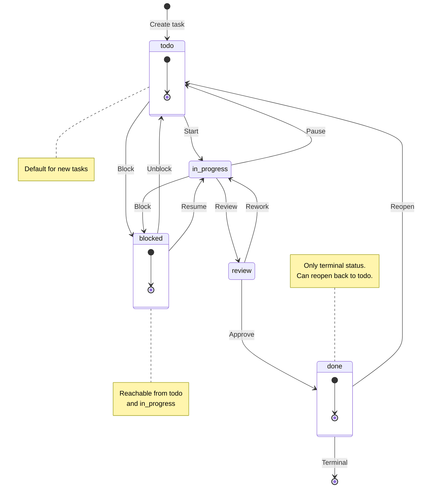

### Auth Flow

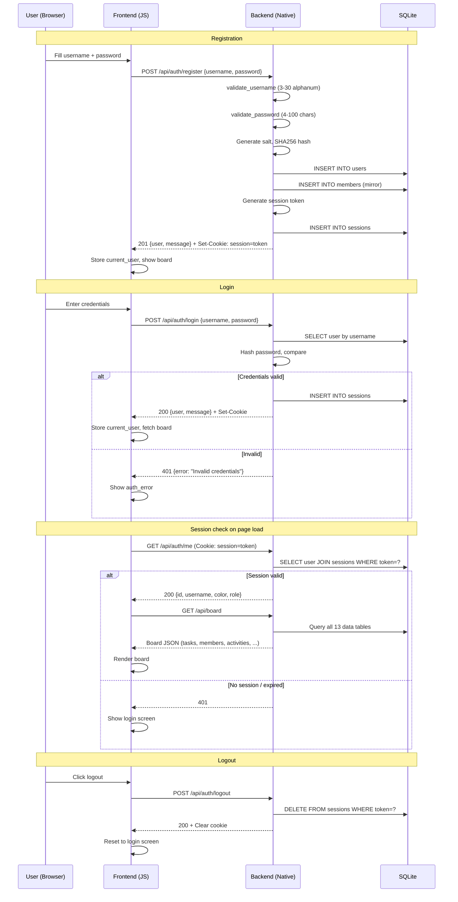

### Frontend Module Map

```mermaid
graph TD
    Main["main.mbt<br/>cell_with_dispatch boot<br/>Init → GET /api/auth/me"]

    subgraph "app/ package"
        Types["types.mbt<br/>Model, Msg (50+ variants), Theme"]
        Update["update.mbt<br/>Model::update(msg, dispatch)<br/>State transitions + HTTP commands"]
        View["view.mbt<br/>Model::view(dispatch)<br/>Root dispatcher"]

        View --> ViewAuth["view_auth.mbt<br/>Login / register screen<br/>Language toggle"]
        View --> ViewHeader["view_header.mbt<br/>Top bar: user, nav tabs,<br/>dark mode, lang, logout"]
        View --> ViewFilters["view_filters.mbt<br/>Status, priority, assignee,<br/>urgency, text search"]
        View --> ViewBoard["view_board.mbt<br/>Kanban columns per status<br/>Drag-and-drop cards"]
        View --> ViewTaskItem["view_task_item.mbt<br/>Task card: transitions,<br/>deps, edit/delete"]
        View --> ViewTaskForm["view_task_form.mbt<br/>Add / edit task modal<br/>Priority, assignee, due date"]
        View --> ViewComments["view_comments.mbt<br/>Slide-in panel<br/>Comment thread + input"]
        View --> ViewActivity["view_activity.mbt<br/>Recent status changes<br/>User attribution"]
        View --> ViewDialogs["view_dialogs.mbt<br/>Delete confirmation,<br/>error toast, undo"]
        View --> ViewPickers["view_pickers.mbt<br/>Label picker, project picker,<br/>subtask list, time log"]
        View --> ViewTheme["view_theme.mbt<br/>get_theme(dark_mode)<br/>11 color tokens"]

        UpdateTest["update_test.mbt"]
        ViewTest["view_test.mbt"]
    end

    subgraph "shared/ package"
        Shared["types, status, logic,<br/>validation, routes, i18n"]
    end

    Main --> Types
    Main --> Update
    Main --> View
    Update --> Shared
    View --> Shared
```

## License

Apache-2.0
