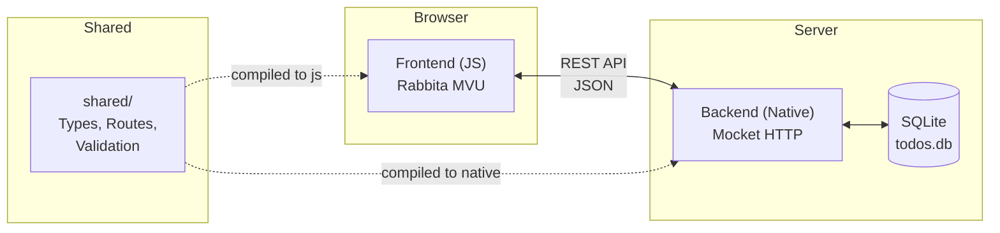
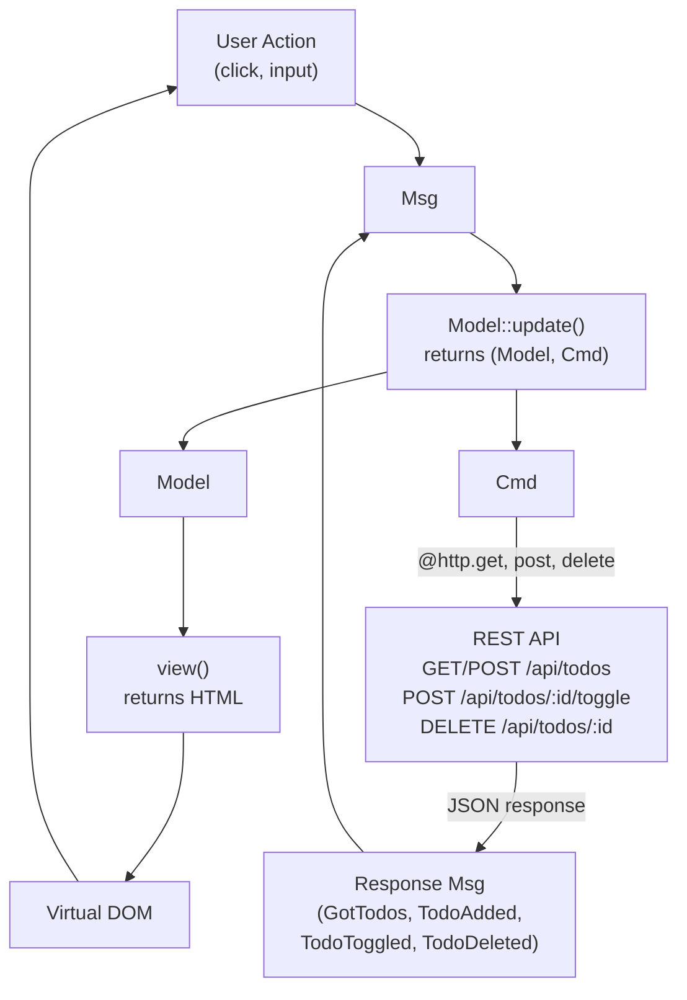
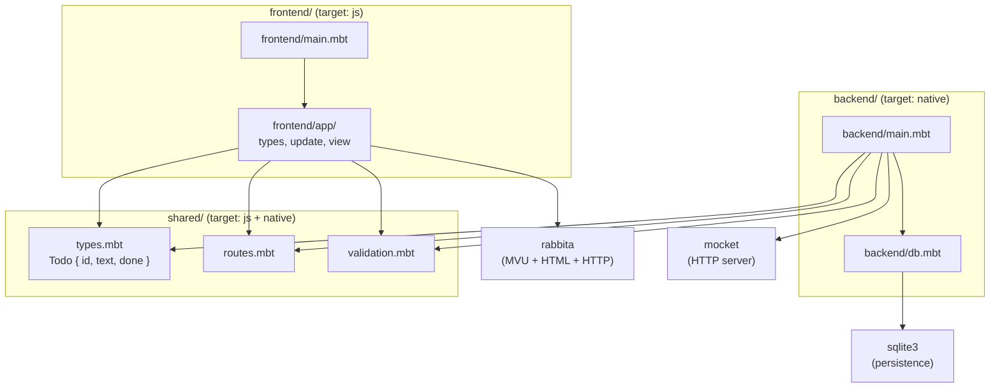

# Todo List

## Works only on nightly release

A full-stack todo list application written entirely in [MoonBit](https://www.moonbitlang.com/), with isomorphic code shared between frontend and backend.

- **Frontend**: [Rabbita](https://github.com/moonbit-community/rabbita) (Elm-architecture UI framework, compiles to JS)
- **Backend**: [Mocket](https://github.com/oboard/mocket) (HTTP server, compiles to native) + [SQLite3](https://github.com/myfreess/sqlite3) (persistence)
- **Shared**: Common types, routes, and validation compiled for both targets

## Quick Start

```bash
moon update
make serve
```

Open http://localhost:4000.

## Features

- Add, toggle, and delete todos
- Data persists in SQLite (`todos.db`)
- Single codebase, two compilation targets (`js` for frontend, `native` for backend)
- REST API with JSON communication between frontend and backend

## Isomorphic Design

MoonBit compiles to multiple targets from the same source. This project uses three packages: `frontend/` targets JS, `backend/` targets native, and `shared/` has no target restriction so it compiles for both.

### What is shared

The `shared/` package contains code that both frontend and backend import:

- **`Todo` type** (`types.mbt`) — one struct with `derive(ToJson, FromJson)`. The backend constructs `Todo` values from SQLite rows and serializes them to JSON. The frontend deserializes the same JSON into the same type. The JSON contract is enforced by the compiler, not by convention.

- **Route paths** (`routes.mbt`) — API paths defined once. The frontend calls `@shared.api_todo(id)` to build request URLs. The backend uses `@shared.api_todos` for route registration. Renaming an endpoint only requires changing one file.

- **Validation** (`validation.mbt`) — `validate_text()` checks that todo text is non-empty and within `max_todo_length` characters. The frontend calls it before submitting, the backend calls it before inserting. Same rule, one definition, enforced on both sides.

### Why it matters

In a typical web stack, frontend and backend define their data types independently. The only thing keeping them in sync is discipline or code generation. When they drift apart, you get runtime errors: a renamed field, a type mismatch, a mistyped route.

With isomorphic MoonBit, the `Todo` type exists once. Add a field and both sides see it immediately — the frontend won't compile until its view handles the new field, and the backend won't compile until its database layer provides it. The compiler does what tests and API specs try to do, but statically.

## API

| Method | Path | Description |
|--------|------|-------------|
| `GET` | `/api/todos` | List all todos |
| `POST` | `/api/todos` | Create a todo (`{"text": "..."}`) |
| `POST` | `/api/todos/:id/toggle` | Toggle done status |
| `DELETE` | `/api/todos/:id` | Delete a todo |

## Project Structure

```
shared/              # Isomorphic code (both js and native)
  types.mbt          #   Todo struct with ToJson/FromJson
  routes.mbt         #   API path constants and builders
  validation.mbt     #   Input validation (max length, non-empty)
backend/main.mbt     # Mocket HTTP server + SQLite3 CRUD
frontend/main.mbt    # Rabbita MVU app (model, update, view)
public/              # Build output for frontend JS
moon.mod.json        # Module config and dependencies
Makefile             # Build and run commands
```

## Architecture Diagrams

### System Architecture



### MVU Data Flow



### Module Dependency Graph



## Todos

TODO: ghost warning about `options("supported-targets": ...)` deprecation when running `moon check --target js`:
```
isomorphic/todoapp$moon check --target js
Warning: `options("supported-targets": ...)` in `moon.pkg` is deprecated. Please use `supported_targets = ...` instead.
```